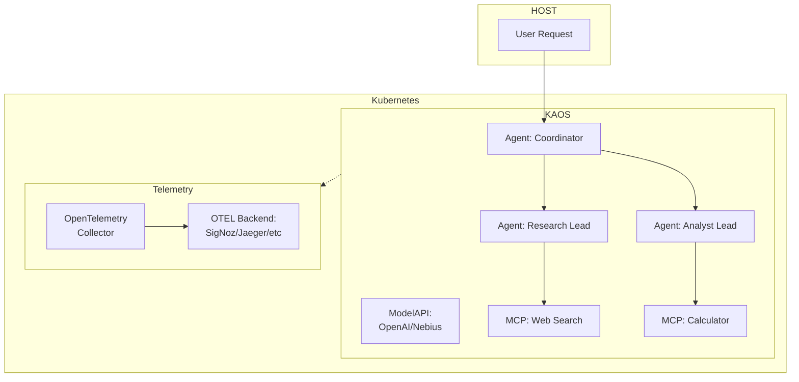
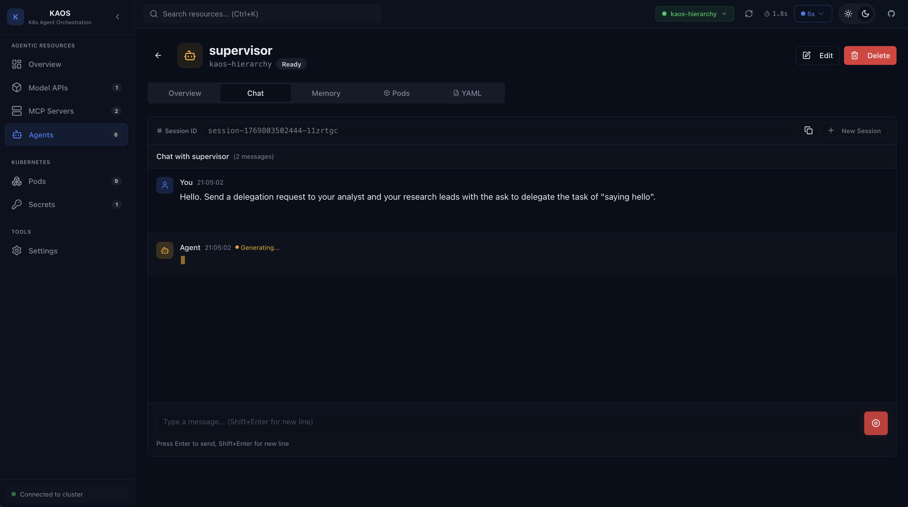
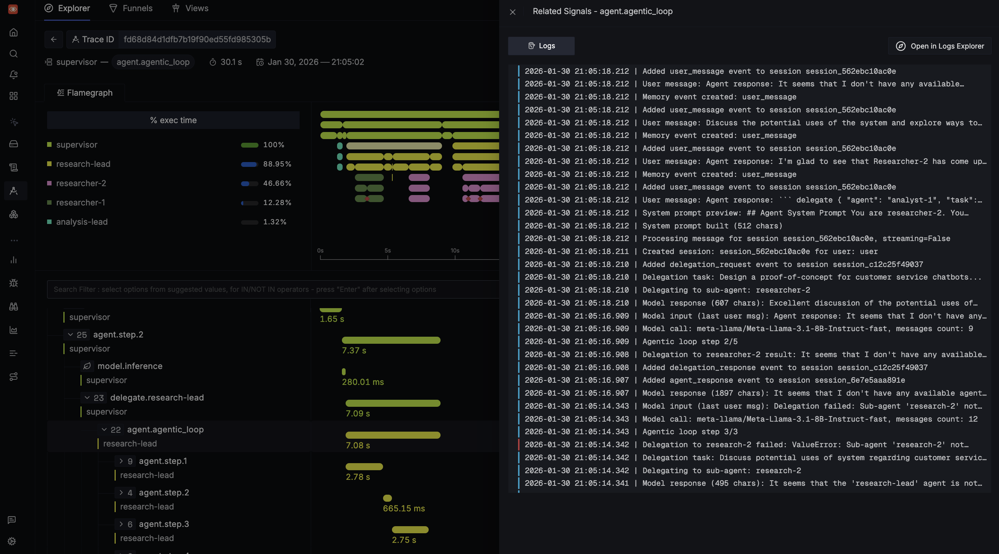
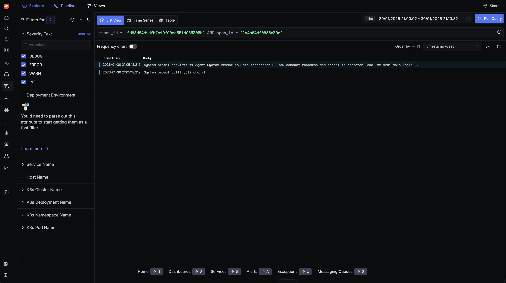
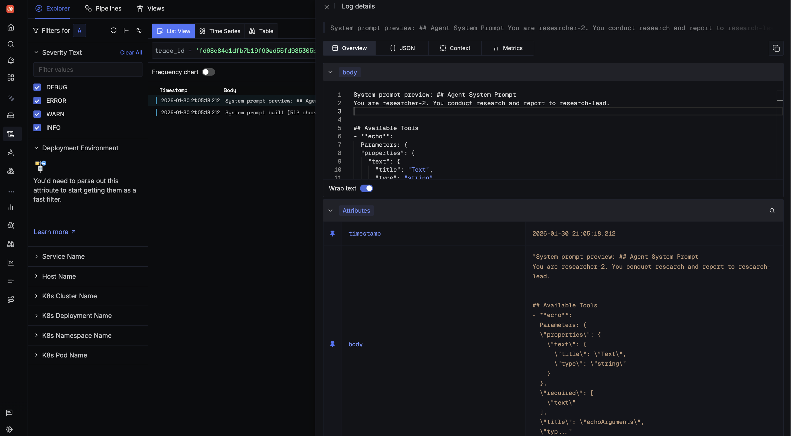
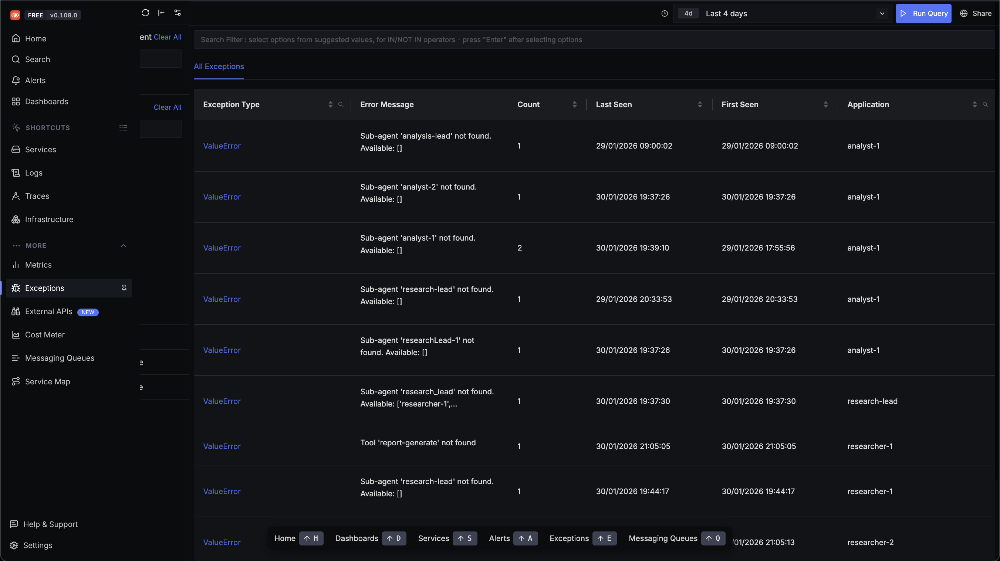
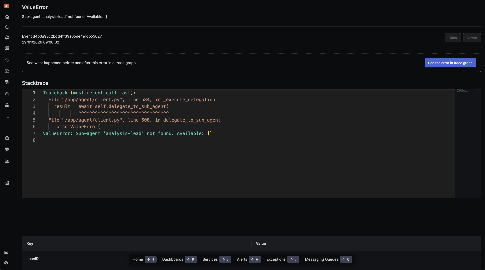
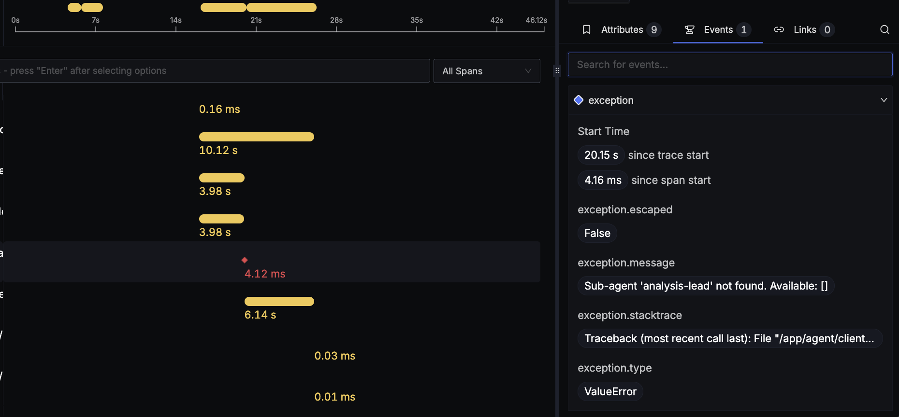
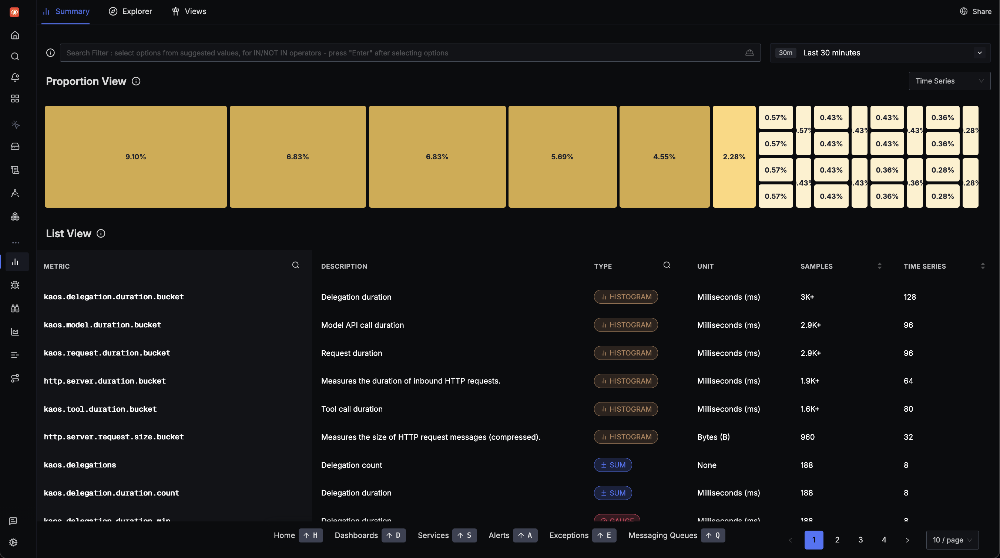
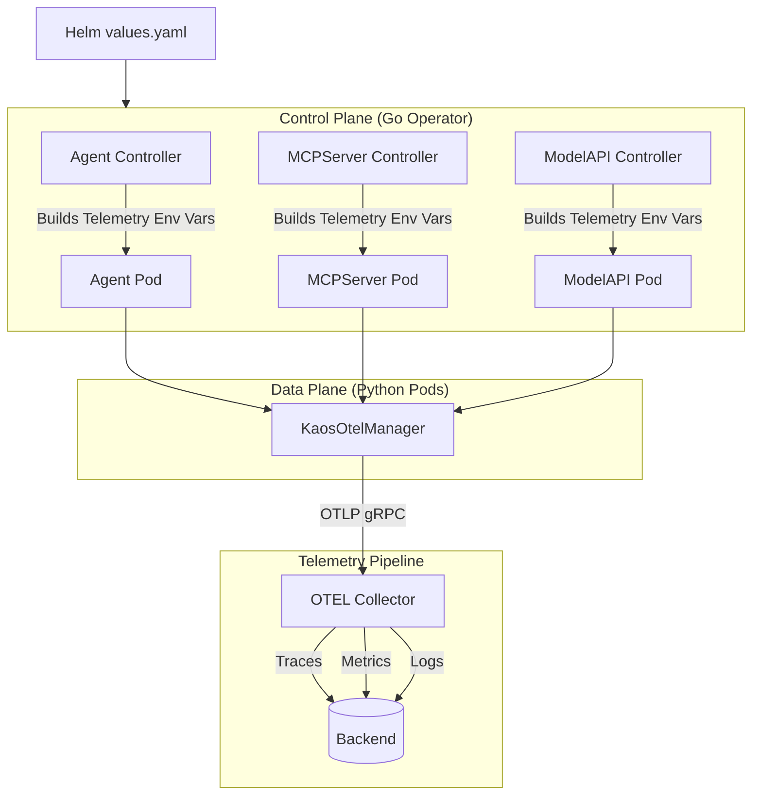

# Monitoring KAOS: Instrumenting Agentic AI Systems with OpenTelemetry

*A practical guide to adding production-grade observability to multi-agent AI systems*

---

You've built an AI agent that works beautifully in development. It chains tools together, delegates tasks to specialist sub-agents, and produces impressive results. Then you deploy it to production.

A user reports that a request "took forever." Another says they got a strange response. Your logs show the agent ran—but what happened inside those 45 seconds between request and response?

Welcome to the observability challenge of agentic systems.

In this article, I'll walk you through a complete end-to-end example of observability for agentic AI systems using OpenTelemetry with KAOS, the Kubernetes Agent Orchestration System.

We'll start with a working demo you can run yourself, visualize traces flowing through a multi-agent system, and then dive deep into the technical challenges of making AI agents observable. By the end, you will leave with the OTEL knowledge to extend your own code with agentic observability.


## Why Agentic Systems Need Different Observability

### It's Not Just a Request-Response

Traditional microservices have predictable patterns: a request comes in, some processing happens, a response goes out. Latency is relatively consistent, code paths are deterministic, and debugging usually involves tracing a single thread of execution.

Agentic systems break all of these assumptions:

| Traditional API | Agentic System |
|-----------------|----------------|
| Synchronous request-response | Iterative reasoning loops |
| Predictable latency (50-500ms) | Variable: 100ms to 60+ seconds |
| Deterministic code paths | Non-deterministic LLM decisions |
| Single service per request | Model calls + tool calls + delegations |
| Fixed cost per request | Cost varies by token usage |

Consider the core loop of an AI agent—the deceptively simple pattern that has led to the current wave of innovation in AI systems:

```python
async def process_message(self, messages):
    for step in range(self.max_steps):
        # 1. Call the LLM
        response = await self.model.chat(messages)
        
        # 2. If the model wants to use a tool, execute it
        if response.has_tool_call:
            result = await self.execute_tool(response.tool_call)
            messages.append({"role": "tool", "content": result})
            continue
        
        # 3. If the model wants to delegate, call another agent
        if response.needs_delegation:
            result = await self.delegate_to_agent(response.delegation)
            messages.append({"role": "assistant", "content": result})
            continue
        
        # 4. Otherwise, we have our final answer
        return response.content
```

Each iteration of this loop may take a different path. The model might need one tool call or five. It might delegate to one sub-agent or chain through three. Traditional logging—"request started," "request completed"—tells you almost nothing about what actually happened.

### The Three Pillars of Agent Observability

OpenTelemetry provides three types of telemetry data, each serving a distinct purpose for agentic systems:

**Traces** answer: "What path did this request take through my agents?"

```
HTTP POST /v1/chat/completions (15.2s total)
└── agent.agentic_loop
    ├── agent.step.1 (3.1s)
    │   └── model.inference (3.0s)
    ├── agent.step.2 (8.5s)
    │   ├── model.inference (2.1s)
    │   └── tool.web_search (6.3s)   ← Here's your bottleneck
    └── agent.step.3 (3.4s)
        └── model.inference (3.3s)
```

This trace hierarchy maps directly to what the agent did:

```
agent.agentic_loop (session_id=abc123, agent.name=coordinator)
├── agent.step.1
│   └── model.inference (gen_ai.request.model=gpt-4)
├── agent.step.2
│   ├── model.inference
│   └── tool.web_search (tool.name=web_search)
├── agent.step.3
│   ├── model.inference
│   └── delegate.researcher (agent.delegation.target=researcher)
└── agent.step.4
    └── model.inference
```

**Metrics** answer: "How is my system performing overall?"

- How many tokens am I using per request?
- What's my tool success rate?
- What's my P99 latency for model calls?

**Logs** answer: "What did the agent 'think' at each step?"

```
2024-01-15 10:30:45 INFO [trace_id=abc123] Starting message processing
2024-01-15 10:30:47 DEBUG [trace_id=abc123] Model response: calling tool 'web_search'
2024-01-15 10:30:53 ERROR [trace_id=abc123] Tool execution failed: API rate limited
```

The magic happens when these three are correlated. Click on that ERROR log in your observability backend, and it takes you to the exact span in the trace where the failure occurred.

### Multi-Agent Context Propagation

The real challenge comes with multi-agent systems. When Agent A delegates to Agent B, which delegates to Agent C, you want a single unified trace—not three disconnected ones.

This requires **context propagation**: passing trace context through HTTP headers using the W3C Trace Context standard. The result is a unified trace across all agents:

```
coordinator.agent.agentic_loop (trace_id: abc123)
├── coordinator.model.inference
├── coordinator.delegate.researcher
│   └── researcher.agent.agentic_loop (same trace_id: abc123!)
│       ├── researcher.model.inference
│       └── researcher.tool.web_search
├── coordinator.model.inference
└── coordinator.delegate.analyst
    └── analyst.agent.agentic_loop (same trace_id: abc123!)
        ├── analyst.model.inference
        └── analyst.tool.calculator
```

## The Practical Use-Case: A Multi-Agent Research System

Let's start with something concrete. We'll use **KAOS** (Kubernetes Agent Orchestration System), an open-source framework I've been building that treats AI agents as first-class Kubernetes resources.

### What We're Building

Our use-case consists of a coordinator agent that delegates research and analysis tasks to specialist sub-agents:



Each component—agents, tools, and model APIs—sends traces, metrics, and logs to an OpenTelemetry collector, which forwards everything to your chosen backend for visualization and analysis.

### Prerequisites

Before we start, you'll need:

1. **A Kubernetes cluster** (KIND, minikube, or a cloud cluster)
2. **kubectl** configured with cluster access
3. **An LLM API key** (OpenAI or Nebius)
4. **KAOS CLI** installed: `pip install kaos-cli`

### Step 1: Install KAOS with Telemetry Enabled

First, let's install the KAOS operator with OpenTelemetry enabled and an observability backend. We'll use SigNoz as an open-source, OpenTelemetry-native option.

**Using the KAOS CLI** (recommended):

```bash
# Install the KAOS operator
kaos system install --wait

# Verify the installation
kaos system status
```

The CLI wraps the Helm installation and provides a simpler interface. After installation, you can check available MCP runtimes:

```bash
kaos system runtimes
```

This shows the registered runtimes like `python-string`, `kubernetes`, `slack`, and `custom`.

<details>
<summary>📋 Alternative: Using Helm directly</summary>

```bash
# Create namespace
kubectl create namespace kaos-system

# Install KAOS with telemetry enabled
helm repo add kaos https://axsaucedo.github.io/kaos
helm install kaos kaos/kaos \
  --namespace kaos-system \
  --set logLevel=DEBUG \
  --set telemetry.enabled=true \
  --set telemetry.endpoint="http://signoz-otel-collector.observability:4317"
```
</details>

Now let's install SigNoz for observability:

```bash
# Create observability namespace
kubectl create namespace observability
kubectl create namespace kaos-hierarchy

# Install SigNoz (OpenTelemetry-native observability backend)
helm repo add signoz https://charts.signoz.io
helm install signoz signoz/signoz --namespace observability
```

To access the SigNoz UI later, use port-forward:

```bash
kubectl port-forward svc/signoz-frontend -n observability 3301:3301
# Open http://localhost:3301
```

### Step 2: Create Your API Key Secret

Create a secret with your LLM provider API key:

```bash
kubectl create secret generic llm-api-key \
  --namespace kaos-hierarchy \
  --from-literal=api-key="your-api-key"
```

### Step 3: Deploy the ModelAPI

The **ModelAPI** resource in KAOS provides a unified interface for LLM access. It supports two modes:

- **Proxy Mode**: Routes requests through LiteLLM to external providers (OpenAI, Anthropic, Nebius, etc.)
- **Hosted Mode**: Runs models locally using Ollama

For observability, the ModelAPI gives us visibility into model call latency, token usage, and error rates—critical metrics for understanding agent performance and controlling costs.

```yaml
apiVersion: kaos.tools/v1alpha1
kind: ModelAPI
metadata:
  name: llm-proxy
  namespace: kaos-hierarchy
spec:
  mode: Proxy
  proxyConfig:
    models: ["*"]
    provider: openai  # alternatively nebius, anthropic, etc.
    apiKeySecretRef:
      name: llm-api-key
      key: api-key
  # Optional: container-level overrides
  container:
    env:
    - name: LITELLM_LOG
      value: "DEBUG"
```

Apply and verify:

```bash
kubectl apply -f modelapi.yaml
kubectl get modelapi -n kaos-hierarchy
# Wait for STATUS: Ready
```

<details>
<summary>📋 Alternative: Using KAOS CLI</summary>

```bash
# Deploy from YAML
kaos modelapi deploy modelapi.yaml

# List ModelAPIs
kaos modelapi list -n kaos-hierarchy

# View logs
kaos modelapi logs llm-proxy -n kaos-hierarchy
```
</details>

<details>
<summary>📋 Using Nebius or other OpenAI-compatible providers</summary>

```yaml
apiVersion: kaos.tools/v1alpha1
kind: ModelAPI
metadata:
  name: llm-proxy
  namespace: kaos-hierarchy
spec:
  mode: Proxy
  proxyConfig:
    models: ["*"]
    provider: openai
    apiBase: https://api.studio.nebius.com/v1  # Custom API base
    apiKeySecretRef:
      name: llm-api-key
      key: api-key
```
</details>

### Step 4: Deploy the MCP Tool Servers

**MCP (Model Context Protocol) Servers** in KAOS provide tools that agents can use. MCP is an open standard for tool integration, allowing agents to interact with external systems through a consistent interface.

KAOS supports multiple MCP runtimes via a ConfigMap-based registry. The most commonly used are:

| Runtime | Description |
|---------|-------------|
| `python-string` | Define tools as inline Python functions |
| `kubernetes` | Kubernetes CRUD operations |
| `slack` | Slack messaging integration |
| `custom` | Your own container image |

For our demo, we'll create a calculator server. In production, you'd connect to real APIs, databases, or external services.

```yaml
# Calculator Tool Server
apiVersion: kaos.tools/v1alpha1
kind: MCPServer
metadata:
  name: calculator
  namespace: kaos-hierarchy
spec:
  runtime: python-string
  params: |
    def add(a: float, b: float) -> float:
        """Add two numbers together."""
        return a + b
        
    def multiply(a: float, b: float) -> float:
        """Multiply two numbers."""
        return a * b
        
    def percentage(value: float, total: float) -> float:
        """Calculate percentage of value relative to total."""
        return (value / total) * 100
---
# Echo Tool Server (for demonstration)
apiVersion: kaos.tools/v1alpha1
kind: MCPServer
metadata:
  name: echo-search
  namespace: kaos-hierarchy
spec:
  runtime: python-string
  params: |
    def web_search(query: str) -> str:
        """Simulate a web search with the given query."""
        return f"Search results for: {query}. [Simulated results: Found 3 relevant articles about {query}]"
        
    def echo(message: str) -> str:
        """Echo back the message for testing."""
        return f"Echo: {message}"
```

Note the simplified CRD structure:
- `runtime: python-string` specifies the MCP runtime to use
- `params:` contains the Python functions directly (passed via `MCP_TOOLS_STRING` env var)

Apply and verify:

```bash
kubectl apply -f mcpservers.yaml
kubectl get mcpserver -n kaos-hierarchy
# Wait for all STATUS: Ready
```

<details>
<summary>📋 Alternative: Using KAOS CLI</summary>

```bash
# Deploy from YAML
kaos mcp deploy mcpservers.yaml

# List MCPServers
kaos mcp list -n kaos-hierarchy

# Invoke a tool directly to test
kaos mcp invoke calculator -n kaos-hierarchy --tool add --args '{"a": 5, "b": 3}'
```
</details>

### Step 5: Deploy the Agents

Now let's deploy our multi-agent system. We'll build progressively:

#### 5a. The Researcher Agent

The **Agent** resource in KAOS represents an AI entity that can process requests, call models, execute tools, and delegate to other agents. Each agent:

- Exposes an OpenAI-compatible `/v1/chat/completions` endpoint
- Implements the agentic loop (model → tools → model → ...)
- Supports configurable memory for session state

The Researcher agent specializes in gathering information:

```yaml
apiVersion: kaos.tools/v1alpha1
kind: Agent
metadata:
  name: researcher
  namespace: kaos-hierarchy
spec:
  modelAPI: llm-proxy
  model: "openai/gpt-4o"
  mcpServers:
    - echo-search
  config:
    description: "Research specialist with web search capabilities"
    instructions: "You research topics using web search and provide detailed findings."
    reasoningLoopMaxSteps: 5
  # Optional: container-level overrides
  container:
    env:
    - name: LOG_LEVEL
      value: "DEBUG"
  agentNetwork:
    expose: true
```

For single-agent observability, we care about:
- **Model call latency**: How long does inference take?
- **Tool execution time**: Are tools responding quickly?
- **Step count**: How many iterations does the agent need?

Apply and verify:

```bash
kubectl apply -f researcher.yaml
kubectl get agent researcher -n kaos-hierarchy
# Wait for STATUS: Ready
```

<details>
<summary>📋 Alternative: Using KAOS CLI</summary>

```bash
# Deploy from YAML
kaos agent deploy researcher.yaml

# List agents
kaos agent list -n kaos-hierarchy

# View logs
kaos agent logs researcher -n kaos-hierarchy --follow
```
</details>

#### 5b. The Analyst Agent

The Analyst agent focuses on data analysis and calculations:

```yaml
apiVersion: kaos.tools/v1alpha1
kind: Agent
metadata:
  name: analyst
  namespace: kaos-hierarchy
spec:
  modelAPI: llm-proxy
  model: "openai/gpt-4o"
  mcpServers:
    - calculator
  config:
    description: "Data analyst with calculation capabilities"
    instructions: "You analyze data and perform calculations."
  agentNetwork:
    expose: true
```

```bash
kubectl apply -f analyst.yaml
kubectl get agent analyst -n kaos-hierarchy
```

#### 5c. The Coordinator Agent

Finally, the Coordinator orchestrates the other agents. For multi-agent observability, we gain additional concerns:

- **Delegation patterns**: Which agents are called and how often?
- **Cross-agent latency**: How much time is spent in delegation vs. local processing?
- **Trace correlation**: Can we see the full request flow across agents?

```yaml
apiVersion: kaos.tools/v1alpha1
kind: Agent
metadata:
  name: coordinator
  namespace: kaos-hierarchy
spec:
  modelAPI: llm-proxy
  model: "openai/gpt-4o"
  config:
    description: "Coordinator that delegates to specialist agents"
    instructions: |
      You are a coordinator. Analyze user requests and delegate:
      - Research questions → researcher agent
      - Calculations or analysis → analyst agent
      Synthesize responses from specialists into a final answer.
    reasoningLoopMaxSteps: 10  # More steps for multi-agent coordination
  agentNetwork:
    expose: true
    access:
      - researcher
      - analyst
```

```bash
kubectl apply -f coordinator.yaml
kubectl get agent -n kaos-hierarchy
# All three agents should show STATUS: Ready
```

<details>
<summary>📋 Alternative: Using KAOS CLI to invoke agents</summary>

```bash
# Invoke an agent directly
kaos agent invoke coordinator -n kaos-hierarchy \
  --message "Research the current AI chip market and calculate the market share"

# Stream the response
kaos agent invoke coordinator -n kaos-hierarchy \
  --message "What is 15% of 200?" --stream
```
</details>

---

## Putting It All Together: Monitoring KAOS

Now let's generate some traffic and see what observability gives us.

### Interacting with Agents

You can interact with agents in multiple ways:

**Using the KAOS CLI** (quick invocation):

```bash
# Invoke the coordinator agent directly
kaos agent invoke coordinator -n kaos-hierarchy \
  --message "Research the current AI chip market and calculate the market share of the top 3 companies."
```

**Using the KAOS UI** (recommended for visualization):

```bash
# Run the KAOS UI locally
kaos ui
# Opens http://localhost:5173
```


*The KAOS UI displays all deployed agents with their status, model configuration, and available tools.*

**Using kubectl port-forward** (for direct API access):

```bash
kubectl port-forward svc/coordinator -n kaos-hierarchy 8080:80
# Then use curl or any HTTP client
```

<details>
<summary>📋 Example curl request</summary>

```bash
curl -X POST http://localhost:8080/v1/chat/completions \
  -H "Content-Type: application/json" \
  -d '{
    "messages": [
      {"role": "user", "content": "Research the current AI chip market and calculate the market share of the top 3 companies."}
    ]
  }'
```
</details>

### Sending a Request

From the KAOS UI, click on the coordinator agent and send a message:



*Sending a multi-step research request: "Research the current AI chip market and calculate the market share of the top 3 companies."*

Behind the scenes, this triggers a complex chain of operations:
1. Coordinator receives the request
2. Coordinator calls the LLM, which decides to delegate
3. Researcher agent is invoked for market research
4. Analyst agent calculates market shares
5. Coordinator synthesizes the final response

All of this—every LLM call, every tool execution, every delegation—is captured in our traces.

### Viewing Traces: Understanding Request Flow

Access your OpenTelemetry backend (SigNoz in this example):

```bash
kubectl port-forward svc/signoz-frontend -n observability 3301:3301
# Open http://localhost:3301 and navigate to Traces
```

**Why traces matter for agentic systems**: Unlike traditional request-response services, agents make multiple decisions per request. Traces let you see each decision point, how long it took, and what path the agent chose.


*The trace list shows all requests flowing through your agents. Each trace represents a complete user interaction.*

Click on a trace to see the full request flow:


*A single trace showing the coordinator delegating to researcher and analyst agents, with each span representing a distinct operation.*

This trace visualization answers questions that would otherwise require hours of log spelunking:

- **Why did this request take 15 seconds?** The web_search tool took 8 seconds.
- **Which agents were involved?** Coordinator → Researcher → Analyst → Coordinator.
- **How many LLM calls were made?** 6 calls across the three agents.
- **Did any tools fail?** All tools completed successfully (green spans).

### Log Correlation: Understanding Agent Reasoning

Traces tell you *what* happened. Logs tell you *why*. OpenTelemetry correlates them automatically through `trace_id` and `span_id` attributes.

Every log entry includes these identifiers, enabling you to:
1. Click on a span in your trace
2. View all logs emitted during that span
3. Understand the agent's reasoning at each step

Click on a span and select "View Logs":



*Logs filtered by trace_id, showing exactly what happened during this span.*

Drill deeper into individual log entries:



*Detailed log view showing the agent's reasoning: "Delegating to researcher for market data..."*

Expand a log entry for full context:



*Full log context including all attributes, resource labels, and the complete message.*

### Exception Tracking: Finding Production Issues

In production, things fail. OpenTelemetry captures exceptions as first-class citizens, attaching them to the span where they occurred.

Navigate to the Exceptions tab:



*Exception overview showing error types, frequency, and affected services.*

Click on an exception to see details:



*Stack trace, error message, and context about when and where this exception occurred.*

The key capability: click "View Trace" to jump directly to the trace where this exception happened:


*The trace showing exactly where in the request flow the exception was thrown.*

Zoom in on the failing span:



*The tool.web_search span marked as ERROR, with the exception attached as a span event.*

This correlation is only possible because we instrument with proper context propagation.

### Metrics: Operational Overview

While traces show individual requests, metrics show trends over time:



*Metrics dashboard showing request rates, latency percentiles, error rates, and token usage across all agents.*

Key metrics for agentic systems:

| Metric | What It Tells You |
|--------|-------------------|
| `kaos.requests` | Request volume by agent |
| `kaos.request.duration` | Latency distribution (P50, P95, P99) |
| `kaos.model.calls` | LLM API usage (cost indicator) |
| `kaos.tool.calls` | Tool execution frequency |
| `kaos.delegations` | Multi-agent coordination patterns |

These metrics enable alerting on production issues:
- Request latency > 30s
- Error rate > 5%
- Model call failures > 1%

---

## Under the Hood: How It Works

Now that you've seen observability in action, let's dive into how it's implemented. The challenges here aren't obvious until you start building—and the solutions are broadly applicable to any agentic system.

### The Architecture

KAOS separates control plane (Go) from data plane (Python):



The key insight: **telemetry configuration flows from Helm → Operator → Data Plane**. Users configure telemetry once in `values.yaml`, and the operator propagates it to all components.

### Instrumenting the Agentic Loop

The core challenge is instrumenting an iterative loop where each iteration may have different operations. Here's the pattern we use:

```python
async def process_message(self, session_id: str, messages: List[Dict]) -> str:
    """Process message through agentic loop with full tracing."""
    
    # Start root span for entire message processing
    span = otel.span_begin("agent.agentic_loop", SpanKind.INTERNAL)
    span.set_attribute("agent.name", self.name)
    span.set_attribute("session.id", session_id)
    span.set_attribute("agent.max_steps", self.max_steps)
    
    try:
        for step in range(self.max_steps):
            # Span for each iteration
            step_span = otel.span_begin(f"agent.step.{step + 1}")
            step_span.set_attribute("step", step + 1)
            
            try:
                # Model inference with its own span
                model_span = otel.span_begin("model.inference", SpanKind.CLIENT)
                model_span.set_attribute("gen_ai.request.model", self.model_name)
                
                try:
                    response = await self.model_api.chat(messages)
                    model_span.set_attribute("gen_ai.response.finish_reason", 
                                             response.finish_reason)
                    otel.span_success(model_span)
                except Exception as e:
                    logger.error(f"Model call failed: {e}")  # Log BEFORE span close
                    otel.span_failure(model_span, e)
                    raise
                
                # Tool execution
                if response.has_tool_call:
                    tool_span = otel.span_begin(f"tool.{response.tool_name}", SpanKind.CLIENT)
                    tool_span.set_attribute("tool.name", response.tool_name)
                    
                    try:
                        result = await self._execute_tool(response.tool_call)
                        messages.append({"role": "tool", "content": result})
                        logger.debug(f"Tool {response.tool_name} returned: {result[:100]}...")
                        otel.span_success(tool_span)
                    except Exception as e:
                        logger.error(f"Tool {response.tool_name} failed: {e}")
                        otel.span_failure(tool_span, e)
                        raise
                    
                    otel.span_success(step_span)
                    continue
                
                # Delegation to sub-agent
                if response.needs_delegation:
                    del_span = otel.span_begin(f"delegate.{response.target_agent}", 
                                                SpanKind.CLIENT)
                    del_span.set_attribute("agent.delegation.target", response.target_agent)
                    
                    try:
                        result = await self._delegate(response.target_agent, response.task)
                        messages.append({"role": "assistant", "content": result})
                        otel.span_success(del_span)
                    except Exception as e:
                        logger.error(f"Delegation to {response.target_agent} failed: {e}")
                        otel.span_failure(del_span, e)
                        raise
                    
                    otel.span_success(step_span)
                    continue
                
                # Final answer
                otel.span_success(step_span)
                otel.span_success(span)
                return response.content
                
            except Exception as e:
                otel.span_failure(step_span, e)
                raise
        
        # Max steps reached
        otel.span_success(span)
        return response.content
        
    except Exception as e:
        otel.span_failure(span, e)
        raise
```

Key patterns to note:

1. **Hierarchical spans**: Parent span for the loop, child spans for each step, grandchild spans for operations
2. **Log before span close**: Emit logs while trace context is active for correlation
3. **Explicit span management**: Use try/finally pattern to ensure spans are always closed

### Context Propagation for Multi-Agent Systems

When delegating to sub-agents (running in separate pods), we must propagate trace context:

```python
# Inject context into outgoing request
from opentelemetry.propagate import inject

async def delegate(self, target_agent: str, task: str) -> str:
    headers = {"Content-Type": "application/json"}
    
    # Inject current trace context into headers
    inject(headers)  # Adds 'traceparent' and 'tracestate' headers
    
    async with httpx.AsyncClient() as client:
        response = await client.post(
            f"http://{target_agent}/v1/chat/completions",
            headers=headers,
            json={"messages": [{"role": "user", "content": task}]}
        )
    return response.json()["choices"][0]["message"]["content"]
```

```python
# Extract context from incoming request
from opentelemetry.propagate import extract

@app.post("/v1/chat/completions")
async def chat(request: Request, body: ChatRequest):
    # Extract trace context from incoming headers
    context = extract(request.headers)
    
    # Attach to current context so new spans are children
    token = otel_context.attach(context)
    try:
        return await agent.process_message(body.messages)
    finally:
        otel_context.detach(token)
```

### Log Export and Correlation

For log-trace correlation, we connect Python's logging to OpenTelemetry:

```python
from opentelemetry.sdk._logs import LoggerProvider
from opentelemetry.sdk._logs.export import BatchLogRecordProcessor
from opentelemetry.exporter.otlp.proto.grpc._log_exporter import OTLPLogExporter
from opentelemetry.instrumentation.logging import LoggingInstrumentor

# Set up OTLP log export
logger_provider = LoggerProvider(resource=resource)
logger_provider.add_log_record_processor(
    BatchLogRecordProcessor(OTLPLogExporter(endpoint=endpoint))
)

# Attach handler to Python root logger
handler = LoggingHandler(level=logging.DEBUG, logger_provider=logger_provider)
logging.getLogger().addHandler(handler)
```

The logging instrumentation automatically injects `trace_id` and `span_id` into log records when there's an active span context.

**Critical pattern**: Always emit logs *before* closing spans:

```python
# Correct: Log while context is active
logger.error(f"Operation failed: {e}")  # Has trace_id ✓
otel.span_failure(span, e)

# Wrong: Log after context is detached
otel.span_failure(span, e)  # Detaches context
logger.error(f"Operation failed: {e}")  # No trace_id!
```

### Metrics for Agent Operations

We track metrics with low-cardinality labels to avoid cardinality explosions:

```python
from opentelemetry import metrics

meter = metrics.get_meter("kaos-agent")

# Counters
request_counter = meter.create_counter(
    "kaos.requests",
    description="Number of requests processed",
    unit="1"
)

model_call_counter = meter.create_counter(
    "kaos.model.calls",
    description="Number of model inference calls",
    unit="1"
)

# Histograms for latency
request_duration = meter.create_histogram(
    "kaos.request.duration",
    description="Request processing duration in milliseconds",
    unit="ms"
)

# Usage example
request_counter.add(1, {"agent.name": self.name, "status": "success"})
request_duration.record(duration_ms, {"agent.name": self.name})
```

**Avoid high-cardinality labels**: Never use session IDs, user IDs, prompt content, or other unbounded values as metric labels. Put those in logs or trace attributes instead.

---

## Summary

Instrumenting agentic AI systems with OpenTelemetry requires understanding the unique challenges these systems present:

1. **Iterative loops** need span hierarchies that map to logical operations
2. **Multi-agent delegation** requires explicit context propagation using W3C Trace Context
3. **Tool execution** benefits from dedicated spans with clear naming
4. **Log-trace correlation** requires emitting logs before span close
5. **Metrics** need low-cardinality labels to avoid storage explosions

The patterns we've covered apply to any agentic system, not just KAOS. Start instrumenting now—the agents of tomorrow will be as ubiquitous as microservices are today, and OpenTelemetry gives you the visibility to operate them with confidence.

---

## Resources

- **KAOS Framework**: [github.com/axsaucedo/kaos](https://github.com/axsaucedo/kaos) - The open-source framework used in this article
- **OpenTelemetry Python**: [opentelemetry.io/docs/languages/python](https://opentelemetry.io/docs/languages/python/) - Official Python SDK documentation
- **OpenTelemetry GenAI Conventions**: [github.com/open-telemetry/semantic-conventions](https://github.com/open-telemetry/semantic-conventions) - Emerging standards for AI observability
- **SigNoz**: [signoz.io](https://signoz.io/) - Open-source APM with native OpenTelemetry support


