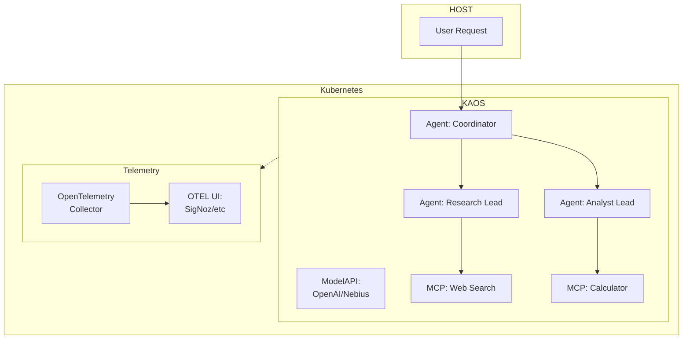
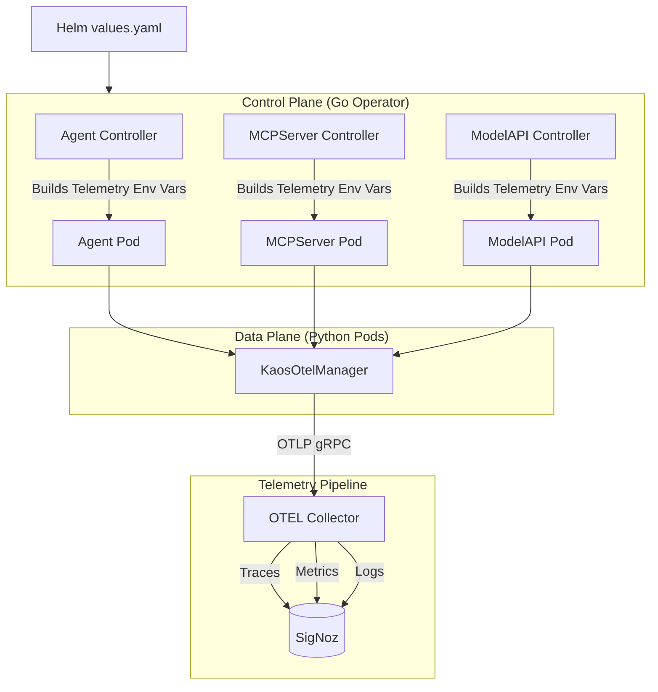

# Monitoring KAOS: Instrumenting Agentic AI Systems with OpenTelemetry

*A practical guide to adding production-grade observability to multi-agent AI systems*

---

You've built an AI agent that works beautifully in development. It chains tools together, delegates tasks to specialist sub-agents, and produces impressive results. Then you deploy it to production.

A user reports that a request "took forever." Another says they got a strange response. Your logs show the agent ran—but what happened inside those 45 seconds between request and response?

Welcome to the observability challenge of agentic systems.

In this article, I'll walk you through a complete end-to-end example of observability for agentic AI systems using OpenTelemetry with KAOS, the Kubernetes Agent Orchestration Framework.

We'll start with a working demo you can run yourself, visualize traces flowing through a multi-agent system using SigNoz, and then dive deep into the technical challenges of making AI agents observable. By the end, you will leave with the OTEL knowledge to extend your own code with agentic observability.


## Why Agentic Systems Need Different Observability

### It's Not Just a Request-Response

Traditional microservices have predictable patterns: a request comes in, some processing happens, a response goes out. Latency is relatively consistent, code paths are deterministic, and debugging usually involves tracing a single thread of execution.

Agentic systems break all of these assumptions:

| Traditional API | Agentic System |
|-----------------|----------------|
| Synchronous request-response | Iterative reasoning loops |
| Predictable latency (50-500ms) | Variable: 100ms to 60+ seconds |
| Deterministic code paths | Non-deterministic LLM decisions |
| Single service per request | Model calls + tool calls + delegations |
| Fixed cost per request | Cost varies by token usage |


Each iteration of this loop may take a different path. The model might need one tool call or five. It might delegate to one sub-agent or chain through three. Traditional logging—"request started," "request completed"—tells you almost nothing about what actually happened.

## The Practical Use-Case: A Multi-Agent Research System

Let's start with something concrete. We'll use **KAOS** (Kubernetes Agent Orchestration System), an open-source framework I've been building that treats AI agents as first-class Kubernetes resources.

### What We're Starting With

Our use-case consists of a coordinator agent that delegates research and analysis tasks to specialist sub-agents:



Each component—agents, tools, and model APIs—sends traces, metrics, and logs to an OpenTelemetry collector, which forwards everything to SigNoz for visualization and analysis.

### Prerequisites

Before we start, you'll need:

1. **A Kubernetes cluster** (KIND, minikube, or a cloud cluster)
2. **Helm** installed
3. **An LLM API key** (OpenAI or Nebius)

<!--
TODO: Instead of introducing the UI all the way at the bottom, here we should introduce both the UI and CLI, namely as we can then start showing screenshots earlier (which reflect the TODOs)
TODO: We have introduced new images that should be attached as these are created so that people can follow the creation on both UI and CLI, these include: 0-ui-kaos-installation, 0-ui-modelapi-creation, 0-ui-mcp-creation, 0-ui-agent-creation, 0-ui-agent-list.
-->

<!--
TODO: as mentioned above we should move the UI part and integrate it as above mentioned; that way we will provide at every step a way of carrying this out in kubernetes with kubectl, then with the UI. You can actually use the UI as the default, and we should also give the option to show the full YAML and kubectl approach and the kaos-cli approach (both which should be under a <details><summary></summary></details> block so that it can be expanded as people want more detail)
-->

### Step 1: Install KAOS with Telemetry Enabled

First, let's install the KAOS operator with OpenTelemetry enabled and SigNoz as our observability backend:

<!--
TODO: Verify that using oci:// is correct as currently we publish the charts differently (see the codebase)
TODO: We can skip adding loadbalancer for signoz as we can just use port-forward
TODO: (done) added creation on kaos-hierarchy - this needs to be updated as per below
-->
```bash
# Create namespaces
kubectl create namespace kaos-system
kubectl create namespace observability
kubectl create namespace kaos-hierarchy

# Install SigNoz (OpenTelemetry-native observability backend)
helm repo add signoz https://charts.signoz.io
helm install signoz signoz/signoz \
  --namespace observability \
  --set queryService.service.type=LoadBalancer

# Install KAOS with telemetry enabled
helm install kaos oci://ghcr.io/axsaucedo/kaos/chart \
  --namespace kaos-system \
  --set logLevel=DEBUG \
  --set telemetry.enabled=true \
  --set telemetry.endpoint="http://signoz-otel-collector.observability:4317"
```

Here we already install KAOS with default telemetry collector endpoint; alternatively we can also define / override it on the respective resources, but this allows us to have a global default.

### Step 2: Create Your API Key Secret

<!--
TODO: Move all of these to another namespace, let's do kaos-hierarchy
-->
**For OpenAI, Nebius or any provider:**
```bash
kubectl create secret generic llm-api-key \
  --namespace kaos-system \
  --from-literal=api-key="your-api-key"
```

### Step 3: Deploy the ModelAPI


<!--
TODO: Add more context on the MOdelAPI and what it's and how it's used, in context of kompute, what metrics do we care about, etc
TODO: Done alraeady remove telemetry as it's set with helm 
-->

**For OpenAI:**
```yaml
apiVersion: kaos.tools/v1alpha1
kind: ModelAPI
metadata:
  name: llm-proxy
  namespace: kaos-system
spec:
  mode: Proxy
  proxyConfig:
    models: ["*"]
    provider: openai # alternatively nebius or any other provider
    apiKeySecretRef:
      name: llm-api-key
      key: api-key
```

### Step 4: Deploy the MCP Tool Servers

<!-- 
TODO: Talk about the MCP Server concept in KAOS and introduce what we're doing
TODO: Also mention how these are test servers and how instead would be different for prod
TODO: Migrate these servers to use the new CRD setup based on PR 46 of KAOS
TODO: Talk about specifically these MCP Servers and how they will be used
-->

```yaml
# Calculator Tool
apiVersion: kaos.tools/v1alpha1
kind: MCPServer
metadata:
  name: calculator
  namespace: kaos-system
spec:
  type: python-runtime
  config:
    tools:
      fromString: |
        def add(a: float, b: float) -> float:
            """Add two numbers together."""
            return a + b
            
        def multiply(a: float, b: float) -> float:
            """Multiply two numbers."""
            return a * b
            
        def percentage(value: float, total: float) -> float:
            """Calculate percentage of value relative to total."""
            return (value / total) * 100
```

<!--
TODO: Here you are missing the other server on web search, either implement it or add another potential simpler server like the echo server (which just returns the input)
-->

### Step 5: Deploy the Agents

<!--
TODO: Talk about the concept of an agent in KAOS by introducing the simplest agent, here we should talk about each of them one by one, starting with the researcher and analyst as these need to be ready before
TODO: When introducing the resaercher can talk about the instructions, and what we care about in regards to the observability of a single agent, similarly then introduce the researcher without as much context
TODO: Then when introducing the coordinator talk more about what we care about on multi-agent and howdo we change on observability here
-->

```yaml
# Coordinator Agent
apiVersion: kaos.tools/v1alpha1
kind: Agent
metadata:
  name: coordinator
  namespace: kaos-system
spec:
  modelAPI: llm-proxy
  model: "openai/gpt-4o"  # or "Qwen/Qwen3-30B-A3B" for Nebius
  config:
    description: "Coordinator that delegates to specialist agents"
    instructions: |
      You are a coordinator. Analyze user requests and delegate:
      - Research questions → researcher agent
      - Calculations or analysis → analyst agent
      Synthesize responses from specialists into a final answer.
  agentNetwork:
    expose: true
    access:
      - researcher
      - analyst
---
# Researcher Agent with Web Search
apiVersion: kaos.tools/v1alpha1
kind: Agent
metadata:
  name: researcher
  namespace: kaos-system
spec:
  modelAPI: llm-proxy
  model: "openai/gpt-4o"
  mcpServers:
    - web-search
  config:
    description: "Research specialist with web search capabilities"
    instructions: "You research topics using web search and provide detailed findings."
    telemetry:
      enabled: true
      endpoint: "http://signoz-otel-collector.observability:4317"
  agentNetwork:
    expose: true
---
# Analyst Agent with Calculator
apiVersion: kaos.tools/v1alpha1
kind: Agent
metadata:
  name: analyst
  namespace: kaos-system
spec:
  modelAPI: llm-proxy
  model: "openai/gpt-4o"
  mcpServers:
    - calculator
  config:
    description: "Data analyst with calculation capabilities"
    instructions: "You analyze data and perform calculations."
    telemetry:
      enabled: true
      endpoint: "http://signoz-otel-collector.observability:4317"
  agentNetwork:
    expose: true
```

<!-- TODO: Instead of applying everything at the very end and waiting for everything, make sure that we apply each and see the status with `kubectl get agent / mcp/ modelapi` to see that htey are ready, instead of here just a rollout at the end whcih is not great -->
Apply all resources:

```bash
kubectl apply -f modelapi.yaml
kubectl apply -f agents.yaml
kubectl apply -f mcpservers.yaml
```

Wait for everything to be ready:

```bash
kubectl wait --for=condition=Ready agent --all -n kaos-system --timeout=120s
```

---

## Putting it all together: Monitoring KAOS

Now let's generate some traffic and see what observability gives us.

<!--
TODO: as mentioned above we should move the UI part and integrate it as above mentioned above instead of just a completely separate one, so delete this.
-->
### The KAOS UI Experience

KAOS provides a web UI for interacting with agents. Port-forward to access it:

<!--
TODO: This is completely wrong, the kaos ui does NOT run in the cluster, you have to run `kaos ui` to open it, and then you can access it. 
-->
```bash
kubectl port-forward svc/kaos-ui -n kaos-system 3000:80
```

Open http://localhost:3000 to see the agent dashboard:

<!-- TODO: This should be integrated above as mentioned -->


*The KAOS UI displays all deployed agents with their status, model configuration, and available tools.*

<!-- TODO: This section should be refactored as let's now send a requets. As mentioend we should also show the kubectl port-forward svc/coordinator version as well as the kubectl ui invoke version (part of the new codebase changes) -->
Click on the coordinator agent and send a message:


*Sending a multi-step research request: "Research the current AI chip market and calculate the market share of the top 3 companies."*

Behind the scenes, this triggers a complex chain of operations:
1. Coordinator receives the request
2. Coordinator calls the LLM, which decides to delegate
3. Researcher agent is invoked for market research
4. Analyst agent calculates market shares
5. Coordinator synthesizes the final response

All of this—every LLM call, every tool execution, every delegation—is captured in our traces.

### Tracing Multi-Agent Flows

<!-- TODO: provide the explicit command now for sure to forward signoz and open as this is something that all users will benefit
TODO: talk about traces and why traces are important

Here is a snippet from another of the blogs that provides a good view:

This produces a trace hierarchy that maps directly to what the agent did:

```
agent.agentic_loop (session_id=abc123, agent.name=coordinator)
├── agent.step.1
│   └── model.inference (gen_ai.request.model=gpt-4)
├── agent.step.2
│   ├── model.inference
│   └── tool.web_search (tool.name=web_search)
├── agent.step.3
│   ├── model.inference
│   └── delegate.researcher (agent.delegation.target=researcher)
└── agent.step.4
    └── model.inference
```

Also we can talk about context propagation:

The real challenge comes with multi-agent systems. When Agent A delegates to Agent B, which delegates to Agent C, you want a single unified trace—not three disconnected ones.

This requires **context propagation**: passing trace context through HTTP headers.
-->


*The trace list shows all requests flowing through your agents. Each trace represents a complete user interaction.*

Click on a trace to see the full request flow:


*A single trace showing the coordinator delegating to researcher and analyst agents, with each span representing a distinct operation.*

This trace visualization answers questions that would otherwise require hours of log spelunking:

- **Why did this request take 15 seconds?** The web_search tool took 8 seconds.
- **Which agents were involved?** Coordinator → Researcher → Analyst → Coordinator.
- **How many LLM calls were made?** 6 calls across the three agents.
- **Did any tools fail?** All tools completed successfully (green spans).

### Log Correlation: The Secret Sauce

<!-- TODO: Talk less about SigNoz and more about OTEL, this will be going on the OTEL blog so we need to make sure that the focus is there, signoz is just going to be the shiny viz tool so we don't have to mention it much
TODO: This section is writen quite lazily, we need to provide more context, more information, not just saying one word and then showing a screenshot - make sure to improve this entire content
-->

Traces tell you *what* happened. Logs tell you *why*. SigNoz correlates them automatically.

Click on a span and select "View Logs":


*Logs filtered by trace_id, showing exactly what happened during this span.*

Every log entry includes `trace_id` and `span_id`, enabling this correlation:


*Detailed log view showing the agent's reasoning: "Delegating to researcher for market data..."*

Click to expand a log entry:


*Full log context including all attributes, resource labels, and the complete message.*

### Exception Tracking: Finding the Needle

In production, things fail. OpenTelemetry captures exceptions as first-class citizens.

Navigate to the Exceptions tab:


*Exception overview showing error types, frequency, and affected services.*

Click on an exception to see details:


*Stack trace, error message, and context about when and where this exception occurred.*

The magic: click "View Trace" to jump directly to the trace where this exception happened:


*The trace showing exactly where in the request flow the exception was thrown.*

Zoom in on the failing span:


*The tool.web_search span marked as ERROR, with the exception attached as a span event.*

This correlation is only possible because we instrument with proper context propagation—more on this later.

### Metrics: The Big Picture

<!-- TODO: This section is also quite poorly set up, improve it -->

While traces show individual requests, metrics show trends over time:


*Metrics dashboard showing request rates, latency percentiles, error rates, and token usage across all agents.*

Key metrics for agentic systems include:

| Metric | What It Tells You |
|--------|-------------------|
| `kaos.requests` | Request volume by agent |
| `kaos.request.duration` | Latency distribution (P50, P95, P99) |
| `kaos.model.calls` | LLM API usage (cost indicator) |
| `kaos.tool.calls` | Tool execution frequency |
| `kaos.delegations` | Multi-agent coordination patterns |

These metrics enable alerting on production issues:
- Request latency > 30s
- Error rate > 5%
- Model call failures > 1%

---

## Under the Hood: How It Works

Now that you've seen observability in action, let's dive into how it's implemented. The challenges here aren't obvious until you start building—and the solutions are broadly applicable to any agentic system.

### The Architecture

KAOS separates control plane (Go) from data plane (Python):



The key insight: **telemetry configuration flows from Helm → Operator → Data Plane**. Users configure telemetry once in `values.yaml`, and the operator propagates it to all components.


---

<!-- TODO: move this actually higher up, as it's written much better, start the previous section with this below, and cover the respective content below integrated into the areas of traces, metrics and logs above respectively-->
### The Three Pillars of Agent Observability

OpenTelemetry provides three types of telemetry data, each serving a distinct purpose for agentic systems:

**Traces** answer: "What path did this request take through my agents?"

```
HTTP POST /v1/chat/completions (15.2s total)
└── agent.agentic_loop
    ├── agent.step.1 (3.1s)
    │   └── model.inference (3.0s)
    ├── agent.step.2 (8.5s)
    │   ├── model.inference (2.1s)
    │   └── tool.web_search (6.3s)   ← Here's your bottleneck
    └── agent.step.3 (3.4s)
        └── model.inference (3.3s)
```

**Metrics** answer: "How is my system performing overall?"

- How many tokens am I using per request?
- What's my tool success rate?
- What's my P99 latency for model calls?

**Logs** answer: "What did the agent 'think' at each step?"

```
2024-01-15 10:30:45 INFO [trace_id=abc123] Starting message processing
2024-01-15 10:30:47 DEBUG [trace_id=abc123] Model response: calling tool 'web_search'
2024-01-15 10:30:53 ERROR [trace_id=abc123] Tool execution failed: API rate limited
```

The magic happens when these three are correlated. Click on that ERROR log in your observability backend, and it takes you to the exact span in the trace where the failure occurred.


<!--
TODO: The section below is currently appendix, but would be ideal to integate above somewhere to ensure that we have an intuition of how this works. Also comment and talk about the agentic loop and how its so simple but it has led to all the innovations; also mention that this is pseudo code but that we'll talk about here how we want to integrate. Maybe we can put this also as part of the telemetry section where we start talking about log/metrics/etc - yes let's do that
-->
Consider the core loop of an AI agent:

```python
async def process_message(self, messages):
    for step in range(self.max_steps):
        # 1. Call the LLM
        response = await self.model.chat(messages)
        
        # 2. If the model wants to use a tool, execute it
        if response.has_tool_call:
            result = await self.execute_tool(response.tool_call)
            messages.append({"role": "tool", "content": result})
            continue
        
        # 3. If the model wants to delegate, call another agent
        if response.needs_delegation:
            result = await self.delegate_to_agent(response.delegation)
            messages.append({"role": "assistant", "content": result})
            continue
        
        # 4. Otherwise, we have our final answer
        return response.content
```

Each iteration of this loop may take a different path. The model might need one tool call or five. It might delegate to one sub-agent or chain through three. Traditional logging—"request started," "request completed"—tells you almost nothing about what actually happened.

<!-- TODO: We'll follow the same approach as above, and include a python code snippet with the premise that we're going deeper. in this case we'll want to also include the pseudo-code for the traces, here we can actually talk about using either the `with` contextmanager keyword even if in KAOS we're not using it and we're doing it sequentially (let's assess if relevant to talk about it); also how we decided to remove the automatic instrucmentation of FastAPI and HTTPX even though we can still link references as that can give some free-lunch
TODO: Similarly we can talk about how it's implemented for the logs, and how this is more of the enabling
TODO: We can also add a mention on the logs how we also decide to separate the logs for collecting the insights wereas the memory is where we capture the entire full extent, which is where we can allow deeper dive, but that this is also something that willl be explored
TODO: And finally for the metrics we can also decide how we approach it, why it's important, how it's there in python, and etc.
-->


