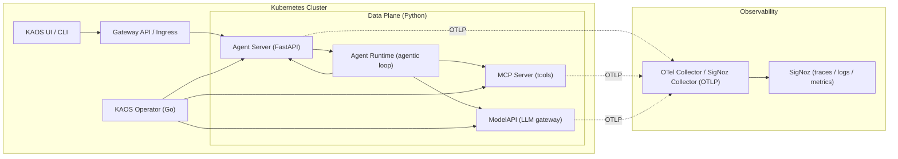
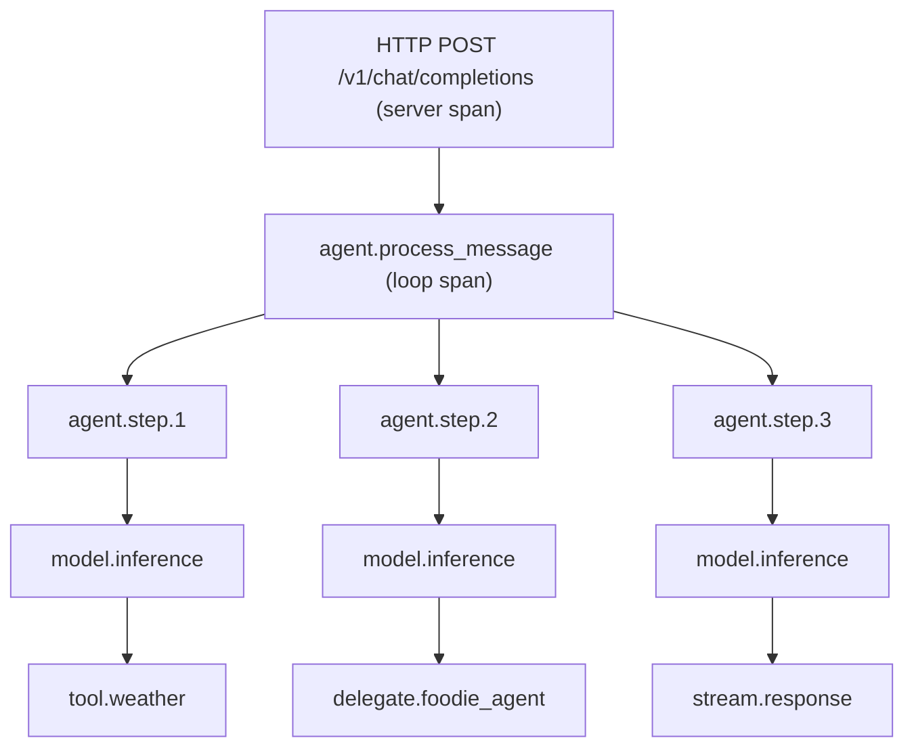

> **Agentic systems don’t “handle requests.” They *run conversations*—iterative, branching, and cross-service by design.**
>
> If you can’t see *the loop*, you can’t debug it. If you can’t correlate *the loop* to logs and metrics, you can’t operate it.

This post shows how to instrument and *operate* agentic workflows using **OpenTelemetry**—starting with an end-to-end example in **KAOS (Kubernetes Agent Orchestration System)** and then going deeper into the internals, pitfalls, and design choices that matter when agents stream, delegate, tool-call, and fail in weird ways.

---

## What you’ll build (in ~15 minutes)

We’ll do three things:

1. Enable OpenTelemetry export from KAOS runtime components (Agent, MCPServer, and optionally ModelAPI).
2. Send a multi-agent request through the KAOS UI.
3. Use SigNoz to:
   - follow the trace across the agentic loop,
   - pivot from trace → logs → exceptions,
   - and validate key metrics (latency + error rates) for model/tool/delegation.

You’ll end with *one correlated story* for every request:

- **Trace** answers: *where did time go and what called what?*
- **Logs** answer: *what did it say and what failed?*
- **Metrics** answer: *is this normal over time?*

---

## 1) End-to-end: KAOS UI → multi-agent request → SigNoz trace/logs/metrics

### 1.1 Prerequisites

- A KAOS cluster deployment (operator + runtime images).
- An OTLP endpoint (SigNoz ships an OpenTelemetry collector, or you can use your own collector).
- Telemetry enabled for the workloads you care about.

**Screenshots to include**
- `1-kaos-ui-home`
- `2-kaos-send-message`

```md


```

> If you don’t have those images as local files yet, keep the filenames above as placeholders and swap paths when publishing.

---

### 1.2 Enable telemetry via Helm defaults (the “one switch” path)

KAOS supports global defaults that apply to components, with per-resource overrides.

Example `values.yaml` fragment:

```yaml
telemetry:
  enabled: true
  endpoint: "http://signoz-otel-collector.observability:4317"

logLevel: INFO
```

This is intentionally simple: **enabled + endpoint** should get you 80% of the way. Advanced tuning stays in standard `OTEL_*` variables.

---

### 1.3 Per-resource override (when you want different services / sampling / endpoints)

For a single Agent resource, you might specify:

```yaml
apiVersion: kaos.tools/v1alpha1
kind: Agent
metadata:
  name: coordinator
spec:
  config:
    telemetry:
      enabled: true
      endpoint: "http://signoz-otel-collector.observability:4317"
    env:
      - name: OTEL_RESOURCE_ATTRIBUTES
        value: "deployment.environment=dev,team=platform"
      - name: OTEL_TRACES_SAMPLER
        value: "parentbased_traceidratio"
      - name: OTEL_TRACES_SAMPLER_ARG
        value: "0.1"
```

The important detail: **KAOS sets KAOS-specific resource attributes**, and you can append your own attributes through `OTEL_RESOURCE_ATTRIBUTES`.

---

### 1.4 Send a multi-agent request

From the KAOS UI, submit a request that triggers all of these:
- one model call,
- at least one tool call,
- and one delegation to a sub-agent.

A practical prompt looks like:

> “Plan a 2-day Berlin itinerary. Use weather + public transport tools, and delegate restaurant research to the foodie agent.”

This gives you an *agentic loop* with branching behavior, which is exactly what we want to observe.

---

### 1.5 Follow the trace in SigNoz

**Screenshots to include**
- `3-signoz-tracing-overview`
- `3-signoz-tracing-overview-2`

```md


```

What you should see:
- A **root server span** (from FastAPI / Starlette instrumentation).
- A **parent “agent message processing” span** (the agentic loop boundary).
- Nested spans for:
  - model inference calls,
  - tool executions,
  - and sub-agent delegation.

The win is not “more spans.” The win is “the spans that match how the system thinks.”

---

### 1.6 Pivot: trace → logs → exception → back to the trace

**Screenshots to include**
- `4-signoz-logs-for-trace`
- `5-signoz-log-deep-dive`
- `6-signoz-log-open`
- `7-signoz-log-exception-list`
- `8-signoz-log-exception-view`
- `9-signoz-log-exception-correlated-trace`
- `9-signoz-log-exception-correlated-trace-zoom`

```md


```

When a tool call fails, you want:
- an exception event tied to the **tool span**, not only to the request span,
- the **log lines emitted during the failure**,
- and the ability to jump back to the trace graph.

That correlation makes debugging agent behavior *boringly mechanical*:
1. open trace,
2. click failing span,
3. view exception,
4. view correlated logs,
5. fix.

---

### 1.7 Validate the golden metrics

**Screenshot to include**
- `10-signoz-metrics`

```md

```

For agents, the “golden metrics” are still the classics (latency, throughput, errors), but you want them *per* model/tool/delegation:

- requests: how many and how long?
- model calls: how many and how long?
- tool calls: how many and how long?
- delegations: how many and how long?

You’ll use these metrics to:
- detect regressions,
- set SLOs,
- and dimension capacity.

---

## 2) KAOS architecture: where telemetry lives

KAOS separates concerns:
- control plane (operator) manages Kubernetes resources,
- data plane (Python runtimes) processes requests.

In practice, observability for agentic workflows must be strongest in the **data plane**, because that’s where the loop lives.

### Architecture map



Key design principle for agent observability:

> The “unit of work” is **not** the HTTP request.
> The “unit of work” is the **agentic loop**, including model/tool/delegation steps.

---

## 3) Modeling agentic work as traces

Traditional web tracing assumes request → response. Agents do:
- request → think → call model → maybe tool → think again → maybe delegate → stream partial output → finish.

So you need a trace model that fits loops, not just RPCs.

### A trace tree that matches agent behavior



With this shape, you can answer:
- “Why did this request take 18s?” → look for the slowest child span.
- “Why did the model call again?” → see the step boundaries.
- “Which tool call caused the failure?” → it has its own span + exception event.

---

## 4) Context propagation across sub-agents and tools

A multi-agent system is distributed by default: even if “coordinator” and “researcher” are both “agents,” they’re *separate services*.

So the core requirement is: **the downstream agent should join the same trace**.

### The propagation contract

Use the W3C Trace Context headers:
- `traceparent`
- `tracestate` (optional)
- plus `baggage` for low-cardinality routing hints (optional)

Practically:
- the upstream agent **injects** trace context into outgoing HTTP headers,
- the downstream agent **extracts** and activates it before starting spans.

### A minimal, explicit implementation pattern

In KAOS, the RemoteAgent path uses a helper that extracts trace headers from incoming requests and forwards them when delegating.

```python
def extract_and_attach_context(headers: Optional[Headers]) -> Dict[str, str]:
    if not headers:
        return {}
    trace_headers = {}
    for key, value in headers.items():
        if key.lower() in ("traceparent", "tracestate"):
            trace_headers[key] = value
    if trace_headers:
        logger.debug("Extracted trace headers for propagation")
    return trace_headers
```

Then delegation calls can include these headers explicitly:

```python
resp = await client.post(
  f"{agent_url}/v1/chat/completions",
  headers=trace_headers,
  json=payload,
)
```

**Why explicit?** Because in agentic systems, you often want:
- context propagation *without* automatically creating a noisy HTTP client span for every internal hop,
- and you want propagation to work even when you’re using nonstandard transports.

---

## 5) KAOS telemetry internals: the KaosOtelManager

If you’re instrumenting an agent loop, you’ll rapidly run into an ergonomic problem:

> Context managers are elegant until your code has `continue`, `yield`, `return`, and nested async calls.

KAOS uses an “inline” span API:
- `span_begin(...)`
- `span_success()`
- `span_failure(exception)`

…backed by a **ContextVar-based span stack** so it works correctly across async boundaries.

### Why a span stack?

Because you want this to work:

```python
otel.span_begin("agent.process_message")
for step in range(max_steps):
    otel.span_begin(f"agent.step.{step}")
    ...
    otel.span_success()  # ends step
otel.span_success()      # ends loop
```

With nesting. With concurrency. Without leaking spans across requests.

### The key idea: SpanState + ContextVar stack

- Each span push stores:
  - span handle,
  - the “context token” for detaching,
  - start time (for metrics),
  - and metric labels (request/model/tool/delegation).
- `span_success()` / `span_failure()` always pop the correct span.

This structure also enables automatic metrics recording on success/failure.

---

## 6) The subtle bug that bites agent systems: span leakage in streaming code

If you only remember one pitfall from this post, remember this:

> **Generators + early returns + exceptions will leak spans unless your pattern is leak-proof.**

Agent loops often stream output:

- you `yield` chunks as the model streams,
- you `continue` steps when tools run,
- you `return` when the agent decides it’s done.

If your span end logic sits in a `try/except/else` block, you might “miss” the end on certain control flows.

### A leak-proof pattern

The safe pattern is:

```python
span = otel.span_begin("tool.execute")
failed = False
try:
    result = await tool(...)
    return result
except Exception as e:
    failed = True
    otel.span_failure(e)
    raise
finally:
    if not failed:
        otel.span_success()
```

It’s not pretty, but it’s correct for:
- early `return`,
- `yield`,
- and `continue` paths.

---

## 7) Log correlation: make logs navigable from traces

Traces answer “where did time go,” but logs answer “what happened.”

For agent systems, logs are especially important because:
- prompts and tool arguments explain why the agent behaved a certain way,
- and tool failures are often best understood from log context.

But logs are only operationally useful when they correlate with traces.

### What “good” correlation looks like

In SigNoz you should be able to:
- open a trace,
- select a span,
- see the correlated logs for that span,
- and open exceptions attached to the span.

To achieve this, you need your logs to carry:
- `trace_id`
- `span_id`

The OpenTelemetry Python logging instrumentation can inject these into log records when there is an active span context.

---

## 8) Metrics: define the minimal set that answers operational questions

You can instrument a lot. You should not.

A pragmatic agent metric set:
- counters: requests, model calls, tool calls, delegations
- histograms: request duration, model duration, tool duration, delegation duration

In KAOS, durations are tracked in **milliseconds** (not seconds).

### Avoid cardinality traps

Agent systems are uniquely prone to high-cardinality labels:
- session IDs,
- user IDs,
- tool arguments,
- raw prompt content,
- file names,
- URLs.

Do **not** put these into metrics labels.

Instead:
- put them into **logs** (with sampling / redaction),
- store them in the trace span attributes if you must (be mindful of payload size),
- keep metrics labels low-cardinality (agent.name, model, tool, success).

---

## 9) Nuances and trade-offs you’ll hit in production

### 9.1 Span noise vs. root-cause speed

If you auto-instrument everything (HTTP clients, database drivers, every internal hop), your trace graph becomes unreadable.

A better approach for agentic systems:
- keep auto-instrumentation for the ingress request,
- instrument agent steps explicitly,
- instrument model/tool/delegation explicitly,
- selectively opt-in to HTTP client spans when debugging a specific dependency.

### 9.2 Sampling: parent-based works best for multi-agent graphs

For multi-service traces:
- use a parent-based sampler so downstream services follow the sampling decision.
- consider a ratio sampler (e.g., 10%) with tail-based sampling in the collector for “capture all errors”.

### 9.3 Redaction and privacy

Agent systems handle user content. Be deliberate:
- never export raw prompt content by default,
- prefer “length + hash” and keep raw content in a protected store,
- add redaction layers for tool arguments (tokens, API keys, personal data).

### 9.4 Naming spans: choose names you can query

Good names:
- `agent.process_message`
- `agent.step`
- `model.inference`
- `tool.<tool_name>`
- `delegate.<agent_name>`

Bad names:
- `step_1` (no domain meaning)
- `call` (unqueryable)
- `tool` (no tool identity)

Consistency beats cleverness.

---

## 10) Where this goes next: GenAI semantic conventions

OpenTelemetry is converging on **GenAI semantic conventions** (for models, prompts, tokens, and tool use). When you align your span attributes to those conventions, you can eventually:
- compare latency by model name across systems,
- correlate token usage to cost,
- and build shared dashboards for LLM services.

The key is to start now with stable, low-risk attributes:
- model name / provider,
- token counts when available,
- tool name and result status,
- delegation target.

---

## Closing: the goal is boring debugging

Agent systems are *dynamic*.
Operations should be *predictable*.

If your observability story is:
- one trace per user request,
- with clear step boundaries,
- correlated logs and exceptions,
- and a minimal metric set…

…then operating agentic systems stops being “AI magic” and becomes “distributed systems with better semantics.”

That’s the bar.

---

### Appendix: Quick checklist

**Traces**
- [ ] root server spans (FastAPI/Starlette)
- [ ] explicit spans for loop + step + model + tool + delegation
- [ ] W3C trace context propagation between agents

**Logs**
- [ ] trace_id/span_id injected into log records
- [ ] exceptions recorded on the span that failed

**Metrics**
- [ ] low-cardinality labels only
- [ ] duration histograms in milliseconds
- [ ] request/model/tool/delegation counters

**Safety**
- [ ] prompt/tool args redaction policy
- [ ] sampling strategy documented

