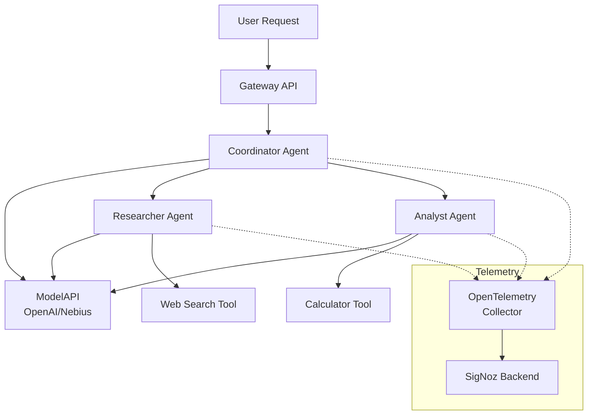
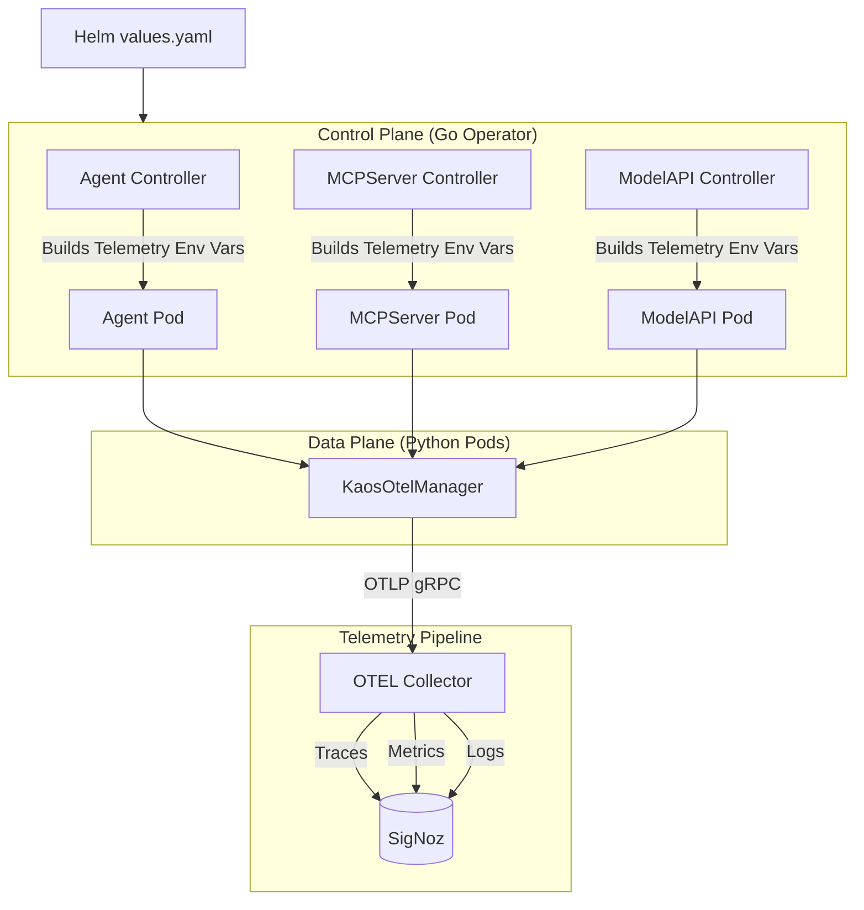
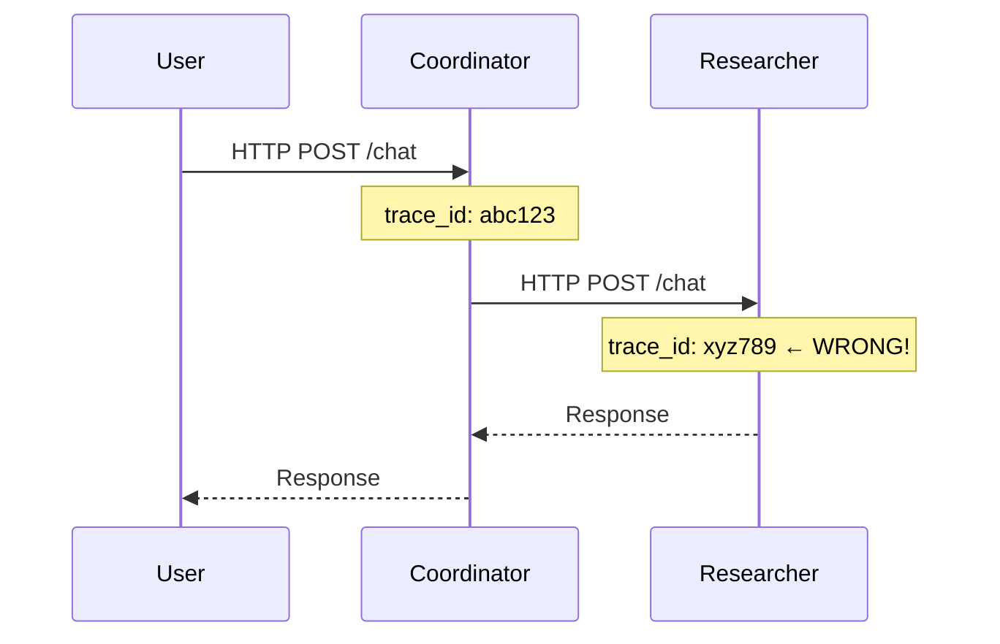
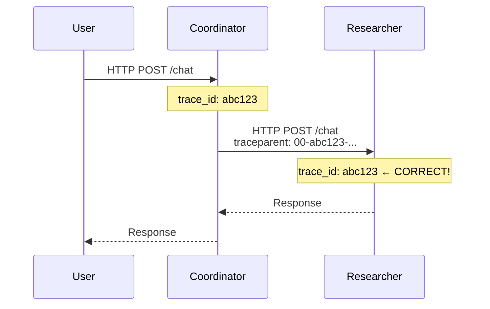

# Observability for Agentic AI Systems: A Practical Guide with OpenTelemetry

*From traces to insights: making AI agents production-ready with comprehensive observability*

---

You've deployed an AI agent system to production. Users are chatting with your multi-agent orchestration, tasks are being delegated across specialist agents, tools are being executed—and you have absolutely no idea what's happening inside.

Sound familiar?

In this article, I'll walk you through a complete end-to-end example of observability for agentic AI systems using OpenTelemetry. We'll start with a working demo you can run yourself, visualize traces flowing through a multi-agent system using SigNoz, and then dive deep into the technical challenges of making AI agents observable. By the end, you'll understand both the "what" and the "how" of agentic observability.

---

## The Demo: Multi-Agent Research System

Let's start with something concrete. We'll use **KAOS** (Kubernetes Agent Orchestration System), an open-source framework I've been building that treats AI agents as first-class Kubernetes resources.

### What We're Building

Our demo consists of a coordinator agent that delegates research and analysis tasks to specialist sub-agents:



Each component—agents, tools, and model APIs—sends traces, metrics, and logs to an OpenTelemetry collector, which forwards everything to SigNoz for visualization and analysis.

### Prerequisites

Before we start, you'll need:

1. **A Kubernetes cluster** (KIND, minikube, or a cloud cluster)
2. **Helm** installed
3. **An LLM API key** (OpenAI or Nebius)

### Step 1: Install KAOS with Telemetry Enabled

First, let's install the KAOS operator with OpenTelemetry enabled and SigNoz as our observability backend:

```bash
# Create namespaces
kubectl create namespace kaos-system
kubectl create namespace observability

# Install SigNoz (OpenTelemetry-native observability backend)
helm repo add signoz https://charts.signoz.io
helm install signoz signoz/signoz \
  --namespace observability \
  --set queryService.service.type=LoadBalancer

# Install KAOS with telemetry enabled
helm install kaos oci://ghcr.io/axsaucedo/kaos/chart \
  --namespace kaos-system \
  --set telemetry.enabled=true \
  --set telemetry.endpoint="http://signoz-otel-collector.observability:4317"
```

### Step 2: Create Your API Key Secret

**For OpenAI:**
```bash
kubectl create secret generic llm-api-key \
  --namespace kaos-system \
  --from-literal=api-key="sk-your-openai-key"
```

**For Nebius (OpenAI-compatible):**
```bash
kubectl create secret generic llm-api-key \
  --namespace kaos-system \
  --from-literal=api-key="your-nebius-key"
```

### Step 3: Deploy the ModelAPI

**For OpenAI:**
```yaml
apiVersion: kaos.tools/v1alpha1
kind: ModelAPI
metadata:
  name: llm-proxy
  namespace: kaos-system
spec:
  mode: Proxy
  telemetry:
    enabled: true
    endpoint: "http://signoz-otel-collector.observability:4317"
  proxyConfig:
    models: ["*"]
    provider: openai
    apiBase: https://api.openai.com/v1
    apiKeySecretRef:
      name: llm-api-key
      key: api-key
```

**For Nebius:**
```yaml
apiVersion: kaos.tools/v1alpha1
kind: ModelAPI
metadata:
  name: llm-proxy
  namespace: kaos-system
spec:
  mode: Proxy
  telemetry:
    enabled: true
    endpoint: "http://signoz-otel-collector.observability:4317"
  proxyConfig:
    models: ["*"]
    provider: openai
    apiBase: https://api.studio.nebius.com/v1  # Nebius endpoint
    apiKeySecretRef:
      name: llm-api-key
      key: api-key
```

### Step 4: Deploy the Agents

```yaml
# Coordinator Agent
apiVersion: kaos.tools/v1alpha1
kind: Agent
metadata:
  name: coordinator
  namespace: kaos-system
spec:
  modelAPI: llm-proxy
  model: "openai/gpt-4o"  # or "openai/Qwen/Qwen3-30B-A3B" for Nebius
  config:
    description: "Coordinator that delegates to specialist agents"
    instructions: |
      You are a coordinator. Analyze user requests and delegate:
      - Research questions → researcher agent
      - Calculations or analysis → analyst agent
      Synthesize responses from specialists into a final answer.
    telemetry:
      enabled: true
      endpoint: "http://signoz-otel-collector.observability:4317"
  agentNetwork:
    expose: true
    access:
      - researcher
      - analyst
---
# Researcher Agent with Web Search
apiVersion: kaos.tools/v1alpha1
kind: Agent
metadata:
  name: researcher
  namespace: kaos-system
spec:
  modelAPI: llm-proxy
  model: "openai/gpt-4o"
  mcpServers:
    - web-search
  config:
    description: "Research specialist with web search capabilities"
    instructions: "You research topics using web search and provide detailed findings."
    telemetry:
      enabled: true
      endpoint: "http://signoz-otel-collector.observability:4317"
  agentNetwork:
    expose: true
---
# Analyst Agent with Calculator
apiVersion: kaos.tools/v1alpha1
kind: Agent
metadata:
  name: analyst
  namespace: kaos-system
spec:
  modelAPI: llm-proxy
  model: "openai/gpt-4o"
  mcpServers:
    - calculator
  config:
    description: "Data analyst with calculation capabilities"
    instructions: "You analyze data and perform calculations."
    telemetry:
      enabled: true
      endpoint: "http://signoz-otel-collector.observability:4317"
  agentNetwork:
    expose: true
```

### Step 5: Deploy the MCP Tool Servers

```yaml
# Calculator Tool
apiVersion: kaos.tools/v1alpha1
kind: MCPServer
metadata:
  name: calculator
  namespace: kaos-system
spec:
  type: python-runtime
  config:
    telemetry:
      enabled: true
      endpoint: "http://signoz-otel-collector.observability:4317"
    tools:
      fromString: |
        def add(a: float, b: float) -> float:
            """Add two numbers together."""
            return a + b
            
        def multiply(a: float, b: float) -> float:
            """Multiply two numbers."""
            return a * b
            
        def percentage(value: float, total: float) -> float:
            """Calculate percentage of value relative to total."""
            return (value / total) * 100
```

Apply all resources:

```bash
kubectl apply -f modelapi.yaml
kubectl apply -f agents.yaml
kubectl apply -f mcpservers.yaml
```

Wait for everything to be ready:

```bash
kubectl wait --for=condition=Ready agent --all -n kaos-system --timeout=120s
```

---

## Seeing Observability in Action

Now let's generate some traffic and see what observability gives us.

### The KAOS UI Experience

KAOS provides a web UI for interacting with agents. Port-forward to access it:

```bash
kubectl port-forward svc/kaos-ui -n kaos-system 3000:80
```

Open http://localhost:3000 to see the agent dashboard:


*The KAOS UI displays all deployed agents with their status, model configuration, and available tools.*

Click on the coordinator agent and send a message:


*Sending a multi-step research request: "Research the current AI chip market and calculate the market share of the top 3 companies."*

Behind the scenes, this triggers a complex chain of operations:
1. Coordinator receives the request
2. Coordinator calls the LLM, which decides to delegate
3. Researcher agent is invoked for market research
4. Analyst agent calculates market shares
5. Coordinator synthesizes the final response

All of this—every LLM call, every tool execution, every delegation—is captured in our traces.

### Tracing Multi-Agent Flows in SigNoz

Open SigNoz (port-forward to port 3301) and navigate to the Traces tab:


*The trace list shows all requests flowing through your agents. Each trace represents a complete user interaction.*

Click on a trace to see the full request flow:


*A single trace showing the coordinator delegating to researcher and analyst agents, with each span representing a distinct operation.*

This trace visualization answers questions that would otherwise require hours of log spelunking:

- **Why did this request take 15 seconds?** The web_search tool took 8 seconds.
- **Which agents were involved?** Coordinator → Researcher → Analyst → Coordinator.
- **How many LLM calls were made?** 6 calls across the three agents.
- **Did any tools fail?** All tools completed successfully (green spans).

### Log Correlation: The Secret Sauce

Traces tell you *what* happened. Logs tell you *why*. SigNoz correlates them automatically.

Click on a span and select "View Logs":


*Logs filtered by trace_id, showing exactly what happened during this span.*

Every log entry includes `trace_id` and `span_id`, enabling this correlation:


*Detailed log view showing the agent's reasoning: "Delegating to researcher for market data..."*

Click to expand a log entry:


*Full log context including all attributes, resource labels, and the complete message.*

### Exception Tracking: Finding the Needle

In production, things fail. OpenTelemetry captures exceptions as first-class citizens.

Navigate to the Exceptions tab:


*Exception overview showing error types, frequency, and affected services.*

Click on an exception to see details:


*Stack trace, error message, and context about when and where this exception occurred.*

The magic: click "View Trace" to jump directly to the trace where this exception happened:


*The trace showing exactly where in the request flow the exception was thrown.*

Zoom in on the failing span:


*The tool.web_search span marked as ERROR, with the exception attached as a span event.*

This correlation is only possible because we instrument with proper context propagation—more on this later.

### Metrics: The Big Picture

While traces show individual requests, metrics show trends over time:


*Metrics dashboard showing request rates, latency percentiles, error rates, and token usage across all agents.*

Key metrics for agentic systems include:

| Metric | What It Tells You |
|--------|-------------------|
| `kaos.requests` | Request volume by agent |
| `kaos.request.duration` | Latency distribution (P50, P95, P99) |
| `kaos.model.calls` | LLM API usage (cost indicator) |
| `kaos.tool.calls` | Tool execution frequency |
| `kaos.delegations` | Multi-agent coordination patterns |

These metrics enable alerting on production issues:
- Request latency > 30s
- Error rate > 5%
- Model call failures > 1%

---

## Under the Hood: How It Works

Now that you've seen observability in action, let's dive into how it's implemented. The challenges here aren't obvious until you start building—and the solutions are broadly applicable to any agentic system.

### The Architecture

KAOS separates control plane (Go) from data plane (Python):



The key insight: **telemetry configuration flows from Helm → Operator → Data Plane**. Users configure telemetry once in `values.yaml`, and the operator propagates it to all components.

### The KaosOtelManager Singleton

At the heart of the Python data plane is a singleton manager that handles all OpenTelemetry operations:

```python
class KaosOtelManager:
    """Singleton manager for OpenTelemetry operations."""
    
    _instance = None
    _initialized = False
    
    def __new__(cls, service_name: str = None):
        if cls._instance is None:
            cls._instance = super().__new__(cls)
        return cls._instance
    
    def init(self, service_name: str = None):
        """Initialize OpenTelemetry SDK."""
        if self._initialized or not self.should_enable():
            return
        
        # Use standard OTEL_* environment variables
        endpoint = os.getenv("OTEL_EXPORTER_OTLP_ENDPOINT")
        service = service_name or os.getenv("OTEL_SERVICE_NAME", "unknown")
        
        resource = Resource.create({
            SERVICE_NAME: service,
            "service.version": os.getenv("SERVICE_VERSION", "unknown"),
        })
        
        # TracerProvider for distributed tracing
        tracer_provider = TracerProvider(resource=resource)
        tracer_provider.add_span_processor(
            BatchSpanProcessor(OTLPSpanExporter(endpoint=endpoint))
        )
        trace.set_tracer_provider(tracer_provider)
        
        # MeterProvider for metrics
        meter_provider = MeterProvider(
            resource=resource,
            metric_readers=[PeriodicExportingMetricReader(
                OTLPMetricExporter(endpoint=endpoint)
            )]
        )
        metrics.set_meter_provider(meter_provider)
        
        # LoggerProvider for OTLP log export
        logger_provider = LoggerProvider(resource=resource)
        logger_provider.add_log_record_processor(
            BatchLogRecordProcessor(OTLPLogExporter(endpoint=endpoint))
        )
        
        # Inject into Python logging
        handler = LoggingHandler(
            level=logging.DEBUG,
            logger_provider=logger_provider
        )
        logging.getLogger().addHandler(handler)
        
        self._initialized = True
    
    def should_enable(self) -> bool:
        """Check if telemetry should be enabled."""
        # Standard OTel env var (note: disabled=false means enabled)
        return os.getenv("OTEL_SDK_DISABLED", "true").lower() == "false"
```

Why a singleton? Because OpenTelemetry's `TracerProvider`, `MeterProvider`, and `LoggerProvider` should only be initialized once per process. Multiple initializations cause resource leaks and corrupted traces.

### Instrumenting the Agentic Loop

The core challenge: an agentic loop is iterative, and each iteration may take different paths. We need spans that capture this structure:

```python
async def process_message(self, session_id: str, messages: list) -> AsyncIterator[str]:
    """Process message through instrumented agentic loop."""
    
    # Parent span for the entire agentic loop
    span = otel.span_begin("agent.agentic_loop", SpanKind.INTERNAL)
    span.set_attribute("agent.name", self.name)
    span.set_attribute("session.id", session_id)
    span.set_attribute("agent.max_steps", self.max_steps)
    
    try:
        for step in range(self.max_steps):
            # Child span for each step
            step_span = otel.span_begin(f"agent.step.{step + 1}", SpanKind.INTERNAL)
            step_span.set_attribute("step", step + 1)
            
            try:
                # Model inference span
                model_span = otel.span_begin("model.inference", SpanKind.CLIENT)
                model_span.set_attribute("gen_ai.request.model", self.model)
                
                response = await self.model_api.chat(messages)
                
                otel.span_success(model_span)
                
                # Check for tool calls
                if response.has_tool_call:
                    tool_span = otel.span_begin(f"tool.{response.tool_name}", SpanKind.CLIENT)
                    tool_span.set_attribute("tool.name", response.tool_name)
                    
                    result = await self.execute_tool(response.tool_call)
                    
                    otel.span_success(tool_span)
                    messages.append({"role": "tool", "content": result})
                    otel.span_success(step_span)
                    continue
                
                # Check for delegation
                if response.needs_delegation:
                    delegate_span = otel.span_begin(
                        f"delegate.{response.target_agent}", 
                        SpanKind.CLIENT
                    )
                    delegate_span.set_attribute("agent.delegation.target", response.target_agent)
                    
                    result = await self.delegate(response.target_agent, response.task)
                    
                    otel.span_success(delegate_span)
                    messages.append({"role": "assistant", "content": result})
                    otel.span_success(step_span)
                    continue
                
                # Final response
                otel.span_success(step_span)
                otel.span_success(span)
                yield response.content
                return
                
            except Exception as e:
                logger.error(f"Step {step + 1} failed: {e}")  # Log BEFORE span close
                otel.span_failure(step_span, e)
                raise
        
        otel.span_success(span)
        
    except Exception as e:
        logger.error(f"Agentic loop failed: {e}")  # Log BEFORE span close
        otel.span_failure(span, e)
        raise
```

This produces the hierarchical traces you saw in SigNoz:

```
agent.agentic_loop (15.2s)
├── agent.step.1 (3.1s)
│   └── model.inference (3.0s)
├── agent.step.2 (8.5s)
│   ├── model.inference (2.1s)
│   └── tool.web_search (6.3s)
├── agent.step.3 (3.2s)
│   ├── model.inference (2.0s)
│   └── delegate.analyst (1.1s)
└── agent.step.4 (3.4s)
    └── model.inference (3.3s)
```

---

## The Hard Parts: Lessons Learned

Building this integration involved ~50 commits of trial and error. Here are the non-obvious lessons that will save you time.

### Challenge 1: Context Propagation Across Agents

When Agent A delegates to Agent B (running in a separate pod/process), how do we maintain trace continuity?

**The Problem:**



Without propagation, each agent creates independent traces. You can't see the full flow.

**The Solution: W3C Trace Context**

```python
# Agent A: Inject context into outgoing request
from opentelemetry.propagate import inject

async def delegate(self, target_agent: str, task: str) -> str:
    headers = {"Content-Type": "application/json"}
    
    # Inject current trace context into headers
    inject(headers)  # Adds 'traceparent' and 'tracestate' headers
    
    async with httpx.AsyncClient() as client:
        response = await client.post(
            f"http://{target_agent}/v1/chat/completions",
            headers=headers,
            json={"messages": [{"role": "user", "content": task}]}
        )
    return response.json()["choices"][0]["message"]["content"]
```

```python
# Agent B: Extract context from incoming request
from opentelemetry.propagate import extract

@app.post("/v1/chat/completions")
async def chat(request: Request, body: ChatRequest):
    # Extract trace context from incoming headers
    context = extract(request.headers)
    
    # Create span as child of caller's span
    with tracer.start_as_current_span("agent.process", context=context):
        return await agent.process_message(body.messages)
```

Now the trace flows correctly:



### Challenge 2: Log-Trace Correlation Order

A subtle bug that took hours to track down: logs appearing without `trace_id` in SigNoz.

**The Bug:**

```python
except Exception as e:
    otel.span_failure(span, e)  # Ends span and detaches context
    logger.error(f"Failed: {e}")  # No trace context attached!
```

When `span_failure()` ends the span, it detaches the trace context. Any logs emitted afterward have no `trace_id`.

**The Fix:**

```python
except Exception as e:
    logger.error(f"Failed: {e}")  # Has trace context ✓
    otel.span_failure(span, e)    # Now safe to detach
```

Always emit logs **before** closing spans.

### Challenge 3: Health Check Noise

Kubernetes probes your pods constantly:

```yaml
livenessProbe:
  httpGet:
    path: /health
    port: 8080
  periodSeconds: 10
```

That's 360 `/health` requests per hour per pod. Multiply by the number of pods, and your trace storage fills with noise.

**The Solution: URL Exclusion**

```python
# For FastAPI/Starlette instrumentation
os.environ["OTEL_PYTHON_FASTAPI_EXCLUDED_URLS"] = "/health,/ready"
```

Important: This uses `re.search()`, not `re.match()`. Don't use regex anchors:

```python
# Wrong - anchors can cause matching issues
OTEL_PYTHON_FASTAPI_EXCLUDED_URLS = "^/health$"

# Correct
OTEL_PYTHON_FASTAPI_EXCLUDED_URLS = "/health"
```

### Challenge 4: Different Components, Different Env Vars

Not all OpenTelemetry instrumentations use the same environment variables:

| Component | URL Exclusion Env Var |
|-----------|----------------------|
| FastAPI/Starlette | `OTEL_PYTHON_FASTAPI_EXCLUDED_URLS` |
| Generic Python | `OTEL_PYTHON_EXCLUDED_URLS` |
| LiteLLM | `OTEL_EXPORTER` (requires `otlp_grpc` not `otlp`) |

The operator handles these differences:

```go
func (r *AgentReconciler) buildTelemetryEnvVars(agent *Agent) []corev1.EnvVar {
    return []corev1.EnvVar{
        {Name: "OTEL_SDK_DISABLED", Value: "false"},
        {Name: "OTEL_EXPORTER_OTLP_ENDPOINT", Value: telemetry.Endpoint},
        {Name: "OTEL_SERVICE_NAME", Value: agent.Name},
        // FastAPI-specific exclusion
        {Name: "OTEL_PYTHON_FASTAPI_EXCLUDED_URLS", Value: "/health,/ready"},
    }
}

func (r *ModelAPIReconciler) buildTelemetryEnvVars(api *ModelAPI) []corev1.EnvVar {
    if api.Spec.Mode == "Proxy" {  // LiteLLM
        return []corev1.EnvVar{
            {Name: "OTEL_EXPORTER", Value: "otlp_grpc"},  // LiteLLM-specific
            {Name: "OTEL_EXPORTER_OTLP_ENDPOINT", Value: telemetry.Endpoint},
            // LiteLLM uses different exclusion var
            {Name: "OTEL_PYTHON_EXCLUDED_URLS", Value: "/health"},
        }
    }
    return nil  // Ollama has no OTel support
}
```

### Challenge 5: HTTPX Instrumentation Noise

MCP tools use Server-Sent Events (SSE) for streaming. HTTPX auto-instrumentation creates a span for **every** SSE chunk—potentially hundreds per tool call.

**The Solution: Opt-In Instrumentation**

```python
# Default: no HTTPX instrumentation (reduces noise)
OTEL_INCLUDE_HTTP_CLIENT = "false"

# Only enable if you need to debug HTTP calls
if os.getenv("OTEL_INCLUDE_HTTP_CLIENT", "false").lower() == "true":
    HTTPXClientInstrumentor().instrument()
```

We also suppress noisy loggers:

```python
logging.getLogger("httpx").setLevel(logging.WARNING)
logging.getLogger("httpcore").setLevel(logging.WARNING)
logging.getLogger("mcp.client.streamable_http").setLevel(logging.WARNING)
```

---

## What You Can Do with This

With comprehensive observability in place, you unlock capabilities that were previously impossible:

### 1. Debug "Slow" Requests Instantly

User reports: "My request took forever."

Before: Grep through logs across multiple pods, try to correlate timestamps, guess what happened.

After: Search traces by duration > 10s, click on the trace, see exactly which span took the time.

### 2. Understand Agent Behavior

Before: "The agent said something weird."

After: View the logs correlated to that trace, see the model's reasoning at each step, understand why it chose to delegate or which tool it called.

### 3. Cost Attribution

Every model call is a span with the model name attribute. Query:

```sql
SELECT 
  agent_name,
  COUNT(*) as model_calls,
  SUM(duration_ms) as total_model_time
FROM spans
WHERE span_name = 'model.inference'
GROUP BY agent_name
ORDER BY model_calls DESC
```

### 4. Proactive Alerting

Set up alerts on:
- Error rate > 5% for any agent
- P99 latency > 30s for critical paths
- Tool failure rate > 10%

### 5. Capacity Planning

Metrics over time show:
- Which agents are most utilized
- Peak load patterns
- Tool execution bottlenecks

---

## Summary

Observability for agentic AI systems isn't optional—it's essential for production operations. The key principles:

1. **Use OpenTelemetry**: Vendor-neutral, comprehensive, future-proof
2. **Instrument the agentic loop**: Parent spans for the loop, child spans for each step
3. **Propagate context**: W3C Trace Context for multi-agent flows
4. **Correlate everything**: Traces, logs, and metrics with shared trace_id
5. **Filter noise**: Exclude health checks, suppress verbose instrumentations
6. **Mind the details**: Log before span close, use correct env vars per component

The complete code is available in the [KAOS repository](https://github.com/axsaucedo/kaos). Start with the quick setup above, send some requests through your agents, and explore the traces in SigNoz.

The future of AI systems is distributed, multi-agent, and dynamic. OpenTelemetry gives you the visibility to operate them with confidence.

---

*Have questions or want to discuss agentic observability? Find me on [LinkedIn](https://linkedin.com/in/axsaucedo) or open an issue on the [KAOS GitHub repo](https://github.com/axsaucedo/kaos).*
