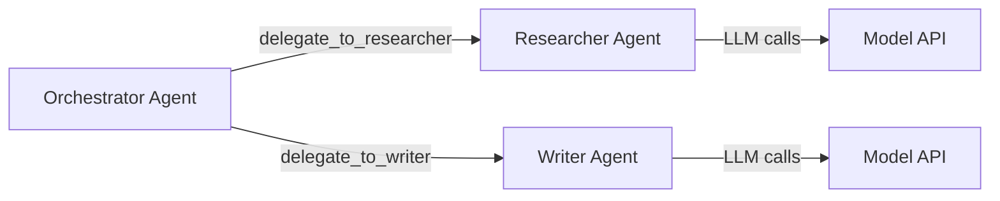
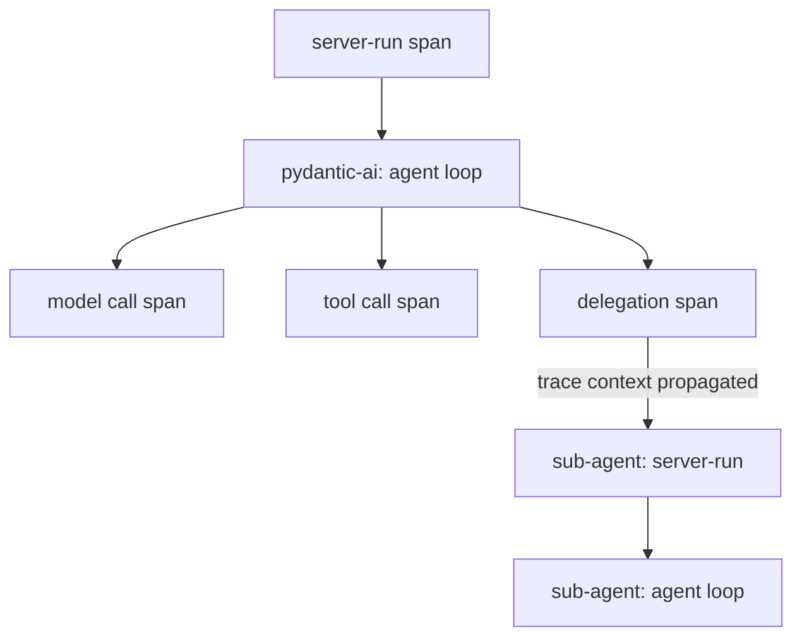

# Choosing a Framework for Distributed Multi-Agent AI Systems (And What We Built on Top)

*How we evaluated 9 agent frameworks, chose Pydantic AI, and built a thin production server for scaling multi-agent systems from laptop to Kubernetes.*

---

## Introduction: What Does a Production Multi-Agent System Actually Need?

It's 2025 and everyone is building AI agents. The demos are impressive — a ReAct loop, a couple of tool calls, maybe a chat UI. But between a demo and a production system that runs at scale, there's a surprisingly long list of requirements that nobody talks about until they hit them:

1. **Model-agnostic execution** — Your agent shouldn't break when you swap GPT-4 for a local Llama model. The framework must support any OpenAI-compatible LLM endpoint.

2. **Structured tool calling** — Tools need type-safe arguments and validated return types. Manual JSON parsing is a bug factory.

3. **Tool calling for limited models** — Not all models support native function calling. Small local models (e.g., Ollama's `smollm2:135m`) need a fallback that parses tool calls from text.

4. **Persistent memory** — LLMs are stateless. Multi-turn conversations require an external memory layer that persists across requests and scales across replicas.

5. **Multi-agent delegation** — A single agent isn't enough. Orchestrators need to delegate tasks to specialist agents and aggregate their results.

6. **Agent discovery** — In a network of agents, how does an orchestrator find out what sub-agents can do? You need a discovery protocol, not hardcoded URLs.

7. **Streaming** — Users expect real-time responses. Streaming needs to be OpenAI-compatible and include progress events for tool execution and delegation.

8. **Observability** — Agents are non-deterministic. A single request can trigger multiple model calls, tool invocations, and cross-service delegations. Without tracing, debugging is guesswork.

9. **Deterministic testing** — You can't run real LLMs in CI. You need a way to inject predictable mock responses that exercise your tools, memory, and delegation logic without calling a model.

10. **Container-native deployment** — The agent must run as a standard container with health probes, graceful shutdown, and configuration via environment variables.

These requirements came from building [KAOS](https://github.com/axsaucedo/kaos), a Kubernetes-native agent orchestration platform, but they apply to **any** system that runs multiple AI agents in production. We documented the full analysis in [issue #89](https://github.com/axsaucedo/kaos/issues/89).

The question was: **build all of this from scratch, or find a framework that handles the hard parts?**

---

## The Framework Decision: Evaluating 9 Options

We evaluated nine frameworks against four key requirements that matter most for distributed multi-agent systems:

| Requirement | Pydantic AI | Google ADK | LangChain | CrewAI | Semantic Kernel | LlamaIndex | AutoGen | Haystack | DSPy |
|-------------|:-----------:|:----------:|:---------:|:------:|:---------------:|:----------:|:-------:|:--------:|:----:|
| **Model-agnostic** (no cloud lock-in) | ✅ | ❌ Vertex lock-in | ✅ | ⚠️ | ✅ | ✅ | ✅ | ✅ | ✅ |
| **Extensible tool system** (custom toolsets) | ✅ `AbstractToolset` | ⚠️ opaque | ✅ | ⚠️ | ⚠️ | ✅ | ⚠️ | ⚠️ | ⚠️ |
| **Native observability** (OTEL) | ✅ first-party | ⚠️ | ⚠️ callback-based | ❌ | ✅ | ⚠️ | ⚠️ | ✅ | ❌ |
| **Clean migration path** (thin integration) | ✅ 9/10 | 8/10 | 6/10 | 5/10 | 6/10 | 6/10 | 5/10 | 4/10 | 5/10 |

**Detailed scores** (from our [full analysis](https://github.com/axsaucedo/kaos/issues/89)):

| Framework | Container | Memory | OTel | A2A | MCP | Migration | **Fit Score** |
|-----------|:---------:|:------:|:----:|:---:|:---:|:---------:|:-------------:|
| **Pydantic AI** | 9 | 6 | 8 | 8 | 7 | 9 | **9** |
| **Google ADK** | 9 | 7 | 7 | 7 | 6 | 8 | **8** |
| **LangChain** | 8 | 7 | 6 | 4 | 7 | 6 | **6** |
| **Semantic Kernel** | 8 | 7 | 8 | 3 | 6 | 6 | **6** |

### Why Pydantic AI Won

Three things made Pydantic AI the clear winner:

1. **`AbstractToolset` protocol.** This is the extensibility mechanism that lets you create custom toolsets (collections of tools) that plug into the agent's execution loop. We used this to implement multi-agent delegation as a first-class toolset — sub-agents appear as callable tools to the model, with no custom loop code. No other framework offered this level of extensibility without forking internals.

2. **No cloud lock-in.** Google ADK scored well on features but its distributed memory only works via Vertex AI. That's a dealbreaker for any system that needs to run on arbitrary infrastructure. Pydantic AI has zero cloud dependencies.

3. **FastAPI-style ergonomics.** Pydantic AI follows the same patterns as FastAPI — type hints, dependency injection via `RunContext`, decorators for tools. Python developers already know this API style. Learning curve is near zero.

### Pydantic AI's Limitations (And How We Addressed Them)

Pydantic AI isn't perfect. Here are the gaps we identified and how we filled them:

| Limitation | Our Solution |
|-----------|-------------|
| No built-in memory persistence | Built `Memory` ABC with Local, Redis, and NullMemory backends |
| No server / HTTP API | Built `AgentServer` with OpenAI-compatible `/v1/chat/completions` |
| No string-mode tool calling (for models without `tool_calls` support) | Built `FunctionModel` wrapper that injects tool descriptions into system prompt |
| No agent discovery protocol | Implemented A2A-compliant agent cards at `/.well-known/agent.json` |
| No mock/testing mode for deterministic CI | Built `DEBUG_MOCK_RESPONSES` via `FunctionModel` with sequential response injection |
| No multi-agent delegation | Built `DelegationToolset` using `AbstractToolset` |

The result is **PAIS (Pydantic AI Server)** — a thin production server that wraps Pydantic AI agents with everything they need to run in distributed systems. The key insight: **Pydantic AI handles the agent (reasoning, tools, validation). PAIS handles the server (HTTP, memory, delegation, observability).**

---

## Your First Agent in 5 Lines

Before diving into production concerns, here's what a PAIS agent looks like. It's pure Pydantic AI with zero boilerplate:

```python
# server.py
from pydantic_ai import Agent

agent = Agent(
    model="test",
    instructions="You are a helpful assistant.",
    defer_model_check=True,
)

@agent.tool_plain
def greet(name: str) -> str:
    """Say hello to someone."""
    return f"Hello, {name}!"
```

Run it:

```bash
pip install pydantic-ai-server[cli]

AGENT_NAME=greeter MODEL_API_URL=http://localhost:11434 MODEL_NAME=llama3.2 \
  pais run
```

That's it. The `pais run` CLI discovers your `Agent` instance, wraps it with production capabilities (health probes, streaming API, A2A discovery card, memory), and serves it on port 8000. Your agent code is pure Pydantic AI — no vendor-specific imports.

Test it:

```bash
curl http://localhost:8000/v1/chat/completions \
  -H "Content-Type: application/json" \
  -d '{"model":"agent","messages":[{"role":"user","content":"Greet Alice"}]}'
```

The response is OpenAI-compatible, which means any client library (OpenAI Python SDK, LangChain, curl) works out of the box.

---

## Problem: Agents Forget Everything → Solution: Pluggable Memory

### The Problem

LLMs are stateless. Every API call starts with a blank slate. If you ask "What did I just say?", the model has no idea — unless you pass the entire conversation history with every request. At scale, this creates three sub-problems:

1. **Single-process memory dies with the process.** Restart the container and everything is gone.
2. **Multi-replica deployments need shared state.** If your agent runs on 3 pods, request N+1 might hit a different pod than request N.
3. **Unbounded history breaks models.** Pass 10,000 messages as context and you'll hit token limits, slow responses, and degraded quality.

### The Solution: Memory ABC with Three Backends

PAIS provides a `Memory` abstract base class with three implementations:

```
Memory (ABC)
├── LocalMemory   — In-process dict. Fast, dev-only, dies with the process.
├── RedisMemory   — Distributed. Scales across replicas. Production-ready.
└── NullMemory    — No-op. Every call succeeds silently. For stateless agents.
```

The **NullMemory pattern** is worth highlighting. Instead of sprinkling `if memory_enabled:` checks throughout the codebase, you always call memory methods. `NullMemory.store_event()` does nothing. `NullMemory.get_events()` returns `[]`. Zero branching, zero bugs from forgetting the check.

Configuration is a single environment variable:

```bash
MEMORY_TYPE=local    # dev
MEMORY_TYPE=redis    # production (requires MEMORY_REDIS_URL)
MEMORY_TYPE=null     # stateless
```

### Deep Dive: Building a Memory-Querying Tool

Here's where it gets interesting. PAIS makes memory available to your agent's tools via Pydantic AI's dependency injection. Let's build a tool that lets the model recall previous conversations:

```python
# server.py
from pydantic_ai import Agent, RunContext
from pais.serverutils import AgentDeps

agent = Agent(
    model="test",
    instructions="You are a helpful assistant with memory. Use the recall tool to check past conversations.",
    defer_model_check=True,
    deps_type=AgentDeps,
)

@agent.tool
async def recall_conversation(ctx: RunContext[AgentDeps], query: str) -> str:
    """Search the agent's conversation memory for relevant context.

    Args:
        query: What to look for in past conversations.
    """
    if not ctx.deps.memory:
        return "Memory not available."

    context = await ctx.deps.memory.build_conversation_context(
        ctx.deps.session_id, max_events=10
    )
    if context:
        return f"Here's what I found in past conversations:\n{context}"
    return "No prior conversations found for this session."
```

**How it works:**

1. `AgentDeps` is PAIS's per-request dependency container. It holds the current `session_id` and `memory` backend.
2. Pydantic AI's `RunContext` injects these dependencies into every tool call — no globals, no thread-local hacks.
3. `build_conversation_context()` returns a text summary of recent user/agent exchanges from the current session.
4. The model decides when to call `recall_conversation` based on the conversation flow.

**Why `RunContext` matters for distributed systems:** In production, your agent handles concurrent requests across multiple sessions. `RunContext` ensures each tool invocation gets the correct session's memory — even if 50 requests are being processed simultaneously. This is the same dependency injection pattern FastAPI uses, and it's why Pydantic AI's design was a strong fit.

### Scaling Memory: From Local to Redis

In development, `LocalMemory` keeps everything in a Python dict. When you deploy to Kubernetes with multiple replicas, switch to Redis:

```bash
MEMORY_TYPE=redis
MEMORY_REDIS_URL=redis://redis:6379
```

The Redis backend uses:
- **Hash** per session (metadata)
- **List** per session (events, append-only, LTRIM for bounded storage)
- **Sorted set** for session index (enables listing, cleanup by age)
- **Pipeline** for atomic writes (RPUSH + LTRIM + HSET + ZADD in one round-trip)
- **TTL** on all keys for automatic retention

Memory is also exposed as an API for debugging and monitoring:

```bash
# List all sessions
curl http://localhost:8000/memory/sessions

# Get events for a specific session
curl http://localhost:8000/memory/events?session_id=abc123
```

And context windowing prevents unbounded history from overwhelming the model:

```bash
MEMORY_CONTEXT_LIMIT=10  # Only pass the last 10 events to the model
```

---

## Problem: One Agent Isn't Enough → Solution: Delegation as Tools

### The Problem

Real-world tasks require specialization. A customer support system might need a researcher (looks up docs), a writer (drafts responses), and an escalation agent (handles complex cases). You need a way for agents to delegate tasks to each other.

### The Solution: `DelegationToolset`

PAIS implements multi-agent delegation using Pydantic AI's `AbstractToolset` — the same extension mechanism used for MCP tools. Sub-agents appear as callable tools to the model:



When the orchestrator has access to sub-agents, `DelegationToolset` dynamically creates tools named `delegate_to_{agent_name}`. The model sees them as regular tools:

```
Available tools:
- delegate_to_researcher(task: str) — Delegate a task to the researcher agent
- delegate_to_writer(task: str) — Delegate a task to the writer agent
```

When the model calls `delegate_to_researcher(task="Find recent papers on attention")`, PAIS sends an HTTP request to the researcher agent's `/v1/chat/completions` endpoint with conversation context. The response flows back as a tool result.

**Why `AbstractToolset` matters:** This is the API that made Pydantic AI the winner. `DelegationToolset` and `MCPServerStreamableHTTP` (for MCP tool servers) are both `AbstractToolset` implementations. They plug into the same mechanism — no custom agentic loop, no framework hacks.

### Agent Discovery: A2A Cards

How does an orchestrator know what sub-agents can do? Each PAIS agent serves an A2A-compliant discovery card:

```bash
curl http://researcher:8000/.well-known/agent.json
```

```json
{
  "name": "researcher",
  "description": "Finds relevant papers and documentation",
  "url": "http://researcher:8000",
  "capabilities": { "streaming": true, "stateTransitionHistory": true },
  "skills": [{ "id": "search", "name": "Search", "description": "Research queries" }]
}
```

The [A2A (Agent-to-Agent) protocol](https://google.github.io/A2A/) is an emerging standard for agent interoperability. PAIS implements the discovery portion — agents advertise their capabilities, and orchestrators can inspect them before delegating.

---

## Problem: You Can't Test with Real Models → Solution: Mock Responses

### The Problem

This is one of the least-discussed challenges in multi-agent systems. In production, your agents call LLMs. In CI, you can't:
- **Cost**: Running GPT-4 on every PR costs real money
- **Latency**: Model calls take seconds, CI pipelines should be fast
- **Non-determinism**: The same prompt can produce different outputs, making assertions impossible
- **Availability**: External APIs go down, rate limit, change behavior

But you still need to test the full system — memory persistence, tool execution, delegation, streaming, error handling. You need the model to be predictable without losing the ability to exercise everything around it.

### The Solution: `DEBUG_MOCK_RESPONSES`

PAIS provides a `DEBUG_MOCK_RESPONSES` environment variable that replaces the real model with a sequence of predetermined responses. It uses Pydantic AI's `FunctionModel` — a model implementation where a Python function handles every call:

```bash
# Agent with no tools — single response
export DEBUG_MOCK_RESPONSES='["Hello, I am your assistant!"]'

# Agent with a tool — 2 responses (tool call, then final answer)
export DEBUG_MOCK_RESPONSES='[
  "{\"tool_calls\": [{\"id\": \"call_1\", \"name\": \"greet\", \"arguments\": {\"name\": \"World\"}}]}",
  "The greeting was sent successfully."
]'
```

**How it works:**

1. PAIS detects `DEBUG_MOCK_RESPONSES` at startup and creates a `FunctionModel` instead of a real model
2. Each "model call" pops the next response from the list
3. If the response contains `"tool_calls"`, Pydantic AI treats it as a tool invocation and executes the tools
4. If the response is plain text, Pydantic AI treats it as the final answer and stops

**Why 2 responses for tool calls, not 3?** Pydantic AI's agentic loop stops automatically when text follows tool execution. The old custom framework needed 3 (call → acknowledge → final), but Pydantic AI is smarter about loop termination.

### The ContextVar Bug: A Real-World Gotcha

During development, we hit a subtle bug. The mock response index was stored in a Python `ContextVar` — standard practice for per-request state. But Pydantic AI runs `FunctionModel` handlers in a **copied context** (Python's `contextvars.copy_context()`). Changes to a `ContextVar` inside the handler don't propagate back to the outer context, so the index never advanced — every call returned the first response.

The fix: use a **mutable object captured by closure** instead of a `ContextVar`:

```python
class _MockResponseState:
    def __init__(self, responses):
        self.responses = list(responses)
        self.index = 0

state = _MockResponseState(["response 1", "response 2"])

async def mock_handler(messages, info):
    response = state.responses[state.index]
    state.index += 1
    return parse_response(response)
```

The `state` object lives in the enclosing scope and is shared across all calls — the copied context doesn't interfere because the object itself isn't a `ContextVar`, just a regular Python object referenced by the closure.

This pattern is valuable for anyone building custom `FunctionModel` handlers in Pydantic AI.

---

## Problem: You Don't Know What Happened → Solution: OpenTelemetry

### The Problem

A user sends "Plan my trip to Tokyo". Your orchestrator delegates to a flight agent, a hotel agent, and a restaurant agent. The flight agent calls 3 tools. The hotel agent makes 2 model calls. The restaurant agent fails silently and returns a generic response. Total: ~15 operations across 4 services, all non-deterministic.

Without tracing, your debugging options are: read logs and guess.

### The Solution: Layered OTEL

PAIS takes a two-layer approach:

**Layer 1 — Pydantic AI (automatic):** When OTEL is enabled, Pydantic AI's `instrument_all()` emits spans for every model call, tool invocation, and agentic loop iteration. You get this for free — no code changes.

**Layer 2 — PAIS (delegation + request tracking):** On top of Pydantic AI's spans, PAIS adds:
- `server-run` span wrapping each request (with trace context propagation across agents)
- Delegation spans that connect orchestrator traces to sub-agent traces
- `kaos.delegations` counter and `kaos.delegation.duration` histogram
- Log correlation: every log line includes `trace_id` and `span_id`



Enable it with one flag:

```bash
OTEL_ENABLED=true OTEL_EXPORTER_OTLP_ENDPOINT=http://localhost:4317 pais run
```

**A hard-won lesson about streaming and spans:** The `server-run` OTEL span must be created **inside the generator function**, not in the route handler. In Python, the route handler returns immediately when using `StreamingResponse` — if the span is created there, it closes before the first byte is streamed. Creating it inside `generate_stream()` keeps it alive for the full response:

```python
async def generate_stream():
    with tracer.start_as_current_span("server-run"):  # ← Here, not in the route
        async for chunk in agent.run_stream(...):
            yield format_sse(chunk)
```

**Another gotcha:** Do NOT pass `instrument=True` to the Pydantic AI `Agent` constructor. It creates fresh OTEL defaults that ignore `instrument_all()` settings. Leave it as `None` and configure instrumentation at the class level.

### Recommended Local Observability Stacks

| Stack | Best For | Setup |
|-------|----------|-------|
| [SigNoz](https://signoz.io/) | Full-featured (traces + metrics + logs) | `docker compose up` |
| [Jaeger](https://www.jaegertracing.io/) | Tracing only, minimal | Single binary |
| [Grafana Tempo](https://grafana.com/oss/tempo/) | Grafana ecosystem integration | Grafana + Tempo + OTEL collector |

---

## Problem: Models Can't Call Functions → Solution: String Mode

### The Problem

OpenAI's API supports `tool_calls` natively — the model returns structured JSON specifying which tool to call with what arguments. But many models don't support this, especially:
- Small local models (Ollama's `smollm2`, `phi3`, etc.)
- Older model versions
- Some open-source models hosted via LiteLLM

If you're building a system that runs on arbitrary models, you need a fallback.

### The Solution: String Mode

PAIS provides a "string mode" that injects tool descriptions into the system prompt and parses the model's text response for JSON tool calls. It uses Pydantic AI's `FunctionModel` as a wrapper:

1. Before sending to the model: append tool descriptions to the system prompt with a JSON format instruction
2. After receiving the response: check if the text contains `{"tool_calls": [...]}` and parse it
3. If tool calls found: return `ToolCallPart` objects (Pydantic AI executes the tools as normal)
4. If no tool calls: return `TextPart` (final answer)

The key design principle: **string mode is a transport adapter, not a different execution model.** The same `DelegationToolset`, MCP tools, and agent logic work identically regardless of whether the model uses native or string-mode calling. No code changes for the agent developer:

```bash
TOOL_CALL_MODE=string pais run   # For models without native function calling
TOOL_CALL_MODE=auto   pais run   # Default: use native tool_calls
```

---

## From Laptop to Cluster: The Environment Variable Bridge

A production-ready agent server needs one property above all else: **the same code must run everywhere** — on a developer's laptop, in CI, and on Kubernetes. PAIS achieves this through environment variables as the universal configuration interface:

| Variable | Laptop | CI | Kubernetes |
|----------|--------|-----|-----------|
| `AGENT_NAME` | `my-agent` | `test-agent` | Set by orchestrator |
| `MODEL_API_URL` | `http://localhost:11434` | Mock (not used) | Resolved from service name |
| `MODEL_NAME` | `llama3.2` | Mock (not used) | Set from spec |
| `MEMORY_TYPE` | `local` | `null` | `redis` |
| `DEBUG_MOCK_RESPONSES` | Not set | `'["response"]'` | Not set |
| `OTEL_ENABLED` | `false` | `false` | `true` |

There's no config file format to learn, no secrets management library, no framework-specific configuration. Environment variables are the interface, and any orchestrator — Kubernetes, Docker Compose, Nomad, even a shell script — can provide them.

For Kubernetes, [KAOS](https://github.com/axsaucedo/kaos) provides an operator that manages the full lifecycle:

```bash
# Install the operator
kaos system install --wait

# Deploy a model backend
kaos modelapi deploy api --mode Hosted -m smollm2:135m --wait

# Build and deploy your agent
pais init my-agent && cd my-agent
pais build --name my-agent --tag v1
kaos agent deploy my-agent --modelapi api --model smollm2:135m --expose --wait

# Test it
kaos agent invoke my-agent --message "Hello!"
```

But KAOS is one implementation of the pattern. The environment variable contract is the real abstraction — any deployment system that sets these variables gets a working agent.

---

## What We Learned: 7 Pitfalls from Building a Production Agent Server

### 1. Don't Reimplement What the Framework Gives You

Our custom agentic loop was ~200 lines. Pydantic AI's `agent.run()` replaces it. We added per-tool OTEL spans — reverted them the next day because Pydantic AI already traces every tool call. **Before writing code, check if the framework already does it.**

### 2. ContextVar + Copied Contexts = Pain

Pydantic AI runs `FunctionModel` handlers in a copied context. `ContextVar` state doesn't persist across calls. Use mutable closures instead (see the mock responses section above).

### 3. NullMemory > Boolean Flags

`if memory_enabled: store()` is a bug waiting to happen — somewhere, someone will forget the check. A no-op implementation (`NullMemory`) eliminates the entire class of bugs. Always call the method. The backend decides what happens.

### 4. The Wrapper That Adds Nothing Should Be Removed

Our initial architecture had three layers: Server → Agent Wrapper → Pydantic AI Agent. After weeks of incremental extraction (25+ commits), the wrapper was empty — every method just called the Pydantic AI agent. We deleted it. **~1,100 lines → ~750 lines**, clearer ownership, zero lost functionality.

### 5. Streaming Span Lifecycle Matters

Create OTEL spans where they're *consumed*, not where they're *defined*. Route handlers return immediately for streaming responses. The span must live inside the generator.

### 6. Framework Lock-In Is Cumulative

ADK's Vertex dependency seems small until you realize distributed memory, deployment, and testing all route through GCP. Each small dependency compounds. Pydantic AI's minimal surface area means every extension is *ours*, not a vendor integration.

### 7. Mock Testing Reveals Framework Assumptions

`DEBUG_MOCK_RESPONSES` exposed that Pydantic AI needs 2 responses for tool calls (not 3 like our old framework). It exposed the `ContextVar` bug. It exposed that `instrument=True` on the constructor overrides `instrument_all()`. Mocks are a mirror that reflects how the framework actually works.

---

## Conclusion: The Three-Layer Architecture

After evaluating 9 frameworks, writing ~90 commits, and refactoring twice, we arrived at a clean three-layer architecture:

| Layer | Responsibility | Examples |
|-------|---------------|----------|
| **Agent Framework** (Pydantic AI) | Reasoning, tool dispatch, structured output, model calls | `Agent`, `@agent.tool`, `RunContext`, `AbstractToolset` |
| **Server Wrapper** (PAIS) | HTTP API, memory, delegation, observability, A2A | `AgentServer`, `Memory`, `DelegationToolset`, OTEL |
| **Orchestration Platform** (your choice) | Deployment, scaling, routing, lifecycle | KAOS, Docker Compose, Kubernetes, etc. |

Each layer owns one concern. The interfaces are simple: environment variables (platform → server), Python objects (server → framework), HTTP (agent ↔ agent).

The insight: **frameworks should handle the hard parts (agentic loops, structured validation, tool dispatch), and servers should handle the boring parts (HTTP, memory, health probes, tracing).** Trying to do both in one layer — whether as a custom framework or an opinionated platform — creates coupling that's expensive to maintain and painful to debug.

PAIS is open-source ([github.com/axsaucedo/pydantic-ai-server](https://github.com/axsaucedo/pydantic-ai-server)) and designed to be the thin layer between Pydantic AI and whatever infrastructure you're running on.

```bash
pip install pydantic-ai-server[cli]
pais init my-agent && cd my-agent
pais run
```

---

*Apache 2.0 licensed. Contributions welcome.*

**Links:**
- [PAIS Repository](https://github.com/axsaucedo/pydantic-ai-server)
- [KAOS (Kubernetes Orchestration)](https://github.com/axsaucedo/kaos)
- [Pydantic AI](https://ai.pydantic.dev)
- [Framework Evaluation (Issue #89)](https://github.com/axsaucedo/kaos/issues/89)
- [A2A Protocol](https://google.github.io/A2A/)
