# Building the Pydantic AI Server for Production Multi-Agent Workloads with Fast API (+ Scalable in K8s)

*How we replaced a custom agent framework with Pydantic AI and built a thin server wrapper for Kubernetes-native AI agent orchestration.*

---

Everyone building AI agents eventually writes the same infrastructure: an HTTP API, streaming support, conversation memory, tool dispatch, multi-agent delegation, and observability. The temptation is to build it all from scratch, and that's exactly what I did. As the codebase matured, we were able to take a step back and build upon the tested and proven foundations of the Pydantic AI framework.

This post traces the real development arc of **PAIS (Pydantic AI Server)**, an open-source enterprise wrapper for [Pydantic AI](https://ai.pydantic.dev) agents, built as the data-plane runtime for [KAOS (K8s Agent Orchestration System)](https://github.com/axsaucedo/kaos). Over ~90 commits, a custom Python agent framework was systematically replaced with Pydantic AI, then hardened, extended, and refactored into a clean three-layer architecture.

## Table of Contents

1. [Why Replace a Working Framework?](#why-replace-a-working-framework)
2. [What is PAIS?](#what-is-pais)
3. [The Core Swap](#the-core-swap)
4. [String-Mode Tool Calling](#string-mode-tool-calling)
5. [Streaming and Progress Events](#streaming-and-progress-events)
6. [Memory: Stateful Agents Without Stateful Code](#memory-stateful-agents-without-stateful-code)
7. [Multi-Agent Delegation](#multi-agent-delegation)
8. [Observability with OpenTelemetry](#observability-with-opentelemetry)
9. [The Deep Refactor](#the-deep-refactor)
10. [KAOS Integration: Local Dev to Kubernetes](#kaos-integration-local-dev-to-kubernetes)
11. [Pitfalls and Lessons Learned](#pitfalls-and-lessons-learned)
12. [Conclusion](#conclusion)

---

## Why Replace a Working Framework?

KAOS originally shipped with a custom-built Python agent framework. It handled the agentic loop, tool dispatch, memory, streaming, delegation — everything. It worked. But it also meant maintaining ~2,000 lines of framework code for functionality that mature open-source projects already provide.

We evaluated the options:

| Framework       | Verdict                                                                                                                                |
| --------------- | -------------------------------------------------------------------------------------------------------------------------------------- |
| **Google ADK**  | Strong features, but extreme GCP/Vertex lock-in. Distributed memory only works via Vertex. Interfaces are opaque.                      |
| **LangChain**   | Feature-rich but over-engineered. Abstractions are deep, debugging is painful, and the dependency tree is enormous.                    |
| **CrewAI**      | Opinionated role-based model. Good for specific workflows, but too restrictive as a general-purpose runtime.                           |
| **Pydantic AI** | Clean type-safe interfaces, dependency injection, first-party OTEL support, `AbstractToolset` for extensible tooling. Minimal lock-in. |

Pydantic AI won because it mirrors the design principles of FastAPI — something Python developers already understand — while staying focused on the agent runtime without trying to be the entire platform. Its `AbstractToolset` protocol was the clincher: it let us implement multi-agent delegation as a first-class toolset, not a hack on top of the framework.

> **The thesis:** Use a framework for the agent. Build a thin server for the rest.

---

## What is PAIS?

PAIS is the server layer between your Pydantic AI agent and Kubernetes. It adds everything an agent needs to run in production without touching the agent's core logic:

```mermaid
graph TD
    Client([Client]) -->|POST /v1/chat/completions| Server[AgentServer]

    subgraph PAIS["🥧 PAIS"]
        Server --> Agent[Pydantic AI Agent]
        Server --> Memory[(Memory<br/>Local / Redis)]
        Agent --> Delegation[DelegationToolset]
        Agent --> MCP[MCP Toolsets]
    end

    Agent -->|LLM calls| ModelAPI[Model API]
    Delegation -->|HTTP| SubAgent([Sub-Agents])
    MCP -->|Streamable HTTP| MCPSrv([MCP Tool Servers])

    Server -->|GET /health /ready| K8s([Kubernetes])
    Server -->|GET /.well-known/agent.json| A2A([A2A Discovery])
```



**What PAIS adds:**
- OpenAI-compatible HTTP API (`/v1/chat/completions`) with streaming
- Distributed memory (Local, Redis, or NullMemory)
- Multi-agent delegation via `DelegationToolset`
- A2A agent discovery (`/.well-known/agent.json`)
- Health and readiness probes for Kubernetes
- OpenTelemetry tracing, metrics, and log correlation
- String-mode tool calling for limited models

**What PAIS doesn't do:** The agentic loop, model calls, tool dispatch, and structured output validation — that's all Pydantic AI.

In code, a PAIS agent looks like a pure Pydantic AI agent:

```python
# server.py
from pydantic_ai import Agent

agent = Agent(
    model="test",
    instructions="You are a helpful assistant.",
    defer_model_check=True,
)

@agent.tool_plain
def greet(name: str) -> str:
    """Say hello to someone."""
    return f"Hello, {name}!"
```

Run it with one command:

```bash
AGENT_NAME=greeter MODEL_API_URL=http://localhost:11434 MODEL_NAME=llama3.2 \
  pais run
```

The `pais run` CLI discovers your `Agent` instance, wraps it with `AgentServer` (adding all the production capabilities above), and serves it on port 8000. No KAOS imports. No boilerplate.

---

## The Core Swap

The first and most critical step: replace the custom agentic loop with Pydantic AI's `Agent`.

**Before** — a hand-rolled loop managing model calls, tool dispatch, and termination:

```python
# ~50 lines of loop management
while not done:
    response = await model.chat(messages)
    if response.tool_calls:
        for tc in response.tool_calls:
            result = await execute_tool(tc.name, tc.arguments)
            messages.append(tool_result(tc.id, result))
    else:
        final_answer = response.content
        done = True
```

**After** — one line:

```python
result = await agent.run(
    prompt,
    deps=AgentDeps(session_id=session_id, memory=memory),
    usage_limits=UsageLimits(request_limit=max_steps),
)
```

Pydantic AI handles the entire reason-act cycle. KAOS configures the model via `OpenAIChatModel`:

```python
from pydantic_ai.models.openai import OpenAIModel
from pydantic_ai.providers.openai import OpenAIProvider

model = OpenAIModel(
    model_name,
    provider=OpenAIProvider(base_url=model_api_url + "/v1"),
)
```

> **Gotcha:** The `/v1` suffix is auto-appended to `MODEL_API_URL` if not present. This is required for Ollama's OpenAI-compatible endpoint, which expects paths like `/v1/chat/completions`. A subtle compatibility fix that saved hours of debugging.

The mock response pattern also changed. With the custom framework, testing a tool-calling agent required 3 mock responses (call → intermediate → final). With Pydantic AI, you need only 2 — it stops automatically when text follows tool execution:

```bash
# Tool call: 2 entries (tool invocation + final answer)
export DEBUG_MOCK_RESPONSES='[
  "{\"tool_calls\": [{\"id\": \"call_1\", \"name\": \"greet\", \"arguments\": {\"name\": \"World\"}}]}",
  "The greeting was sent successfully."
]'
```

---

## String-Mode Tool Calling

Not every model supports native function calling. Small local models like Ollama's `smollm2:135m` don't emit `tool_calls` in their responses — they only output text. PAIS solves this with **string mode**: tool descriptions are injected into the system prompt, and the model's text response is parsed for JSON tool calls.

The implementation uses Pydantic AI's `FunctionModel` as a wrapper:

```python
def build_string_mode_handler(base_url, model_name):
    """Wrap model to inject tool descriptions and parse JSON tool calls from text."""

    async def handler(messages, info):
        # Inject tool descriptions into system prompt
        tool_prompt = format_tools_for_prompt(info.function_tools)
        enhanced_messages = inject_system_prompt(messages, tool_prompt)

        # Call the actual model
        response = await call_model(base_url, model_name, enhanced_messages)

        # Parse JSON tool calls from text
        tool_calls = parse_tool_calls_from_text(response.text)
        if tool_calls:
            return ModelResponse(parts=[ToolCallPart(...) for tc in tool_calls])
        return ModelResponse(parts=[TextPart(response.text)])

    return handler
```

The key design principle: **string mode is a transport adapter, not a different execution model.** The same `DelegationToolset`, MCP tools, and agent logic work identically regardless of whether the model uses native or string-mode calling. Configuration is a single environment variable:

```yaml
spec:
  config:
    toolCallMode: string   # or "auto" (default) / "native"
```

---

## Streaming and Progress Events

Real-time streaming uses OpenAI-compatible Server-Sent Events (SSE). When a client sends `"stream": true`, PAIS wraps Pydantic AI's `run_stream()` output in SSE chunks:

```
data: {"choices":[{"delta":{"role":"assistant","content":""}}]}

data: {"choices":[{"delta":{"content":"Let me "}}]}

data: {"choices":[{"delta":{"content":"check that for you."}}]}

data: {"choices":[{"delta":{"content":"","tool_progress":{"name":"echo","step":1}}}]}

data: {"choices":[{"delta":{"content":"The echo tool returned: hello"}}]}

data: [DONE]
```

Notice the `tool_progress` events — these are a PAIS extension that gives clients real-time visibility into tool execution and multi-agent delegation. The progress includes:
- Tool name and step counter
- Whether it's a delegation (`delegate_to_worker`) or a direct tool call
- `max_steps` for progress tracking

```python
def format_progress_event(tool_name: str, step: int, max_steps: int) -> dict:
    return {
        "tool_progress": {
            "name": tool_name,
            "step": step,
            "max_steps": max_steps,
        }
    }
```

Test streaming with curl:

```bash
curl -N http://localhost:8000/v1/chat/completions \
  -H "Content-Type: application/json" \
  -d '{
    "model": "agent",
    "messages": [{"role": "user", "content": "Run the echo tool"}],
    "stream": true
  }'
```

---

## Memory: Stateful Agents Without Stateful Code

LLMs are stateless. Every request starts with a blank slate. Memory bridges the gap between stateless model calls and stateful conversations.

PAIS provides three memory backends:

| Backend | Use Case | Persistence |
|---------|----------|-------------|
| `LocalMemory` | Development, single-replica | In-process dict |
| `RedisMemory` | Production, multi-replica | Distributed Redis |
| `NullMemory` | Stateless agents | No-op (never stores) |

The design follows the **NullMemory pattern**: all three implement the same `Memory` ABC, so agent code never branches on `if memory_enabled`. You always call memory methods — `NullMemory` simply returns empty results:

```python
class Memory(ABC):
    @abstractmethod
    async def store_event(self, session_id: str, event: MemoryEvent) -> None: ...

    @abstractmethod
    async def get_events(self, session_id: str) -> List[MemoryEvent]: ...

    def build_message_history(self, session_id, context_limit):
        """Convert KAOS events → Pydantic AI messages."""
        ...

    def store_pydantic_message(self, session_id, msg):
        """Convert Pydantic AI messages → KAOS events."""
        ...

class NullMemory(Memory):
    async def store_event(self, session_id, event):
        pass  # No-op

    async def get_events(self, session_id):
        return []  # Always empty
```

The conversion layer is the tricky part. KAOS stores memory as `MemoryEvent` objects (with types like `user_message`, `agent_response`, `delegation_request`). Pydantic AI expects `ModelRequest` and `ModelResponse` messages. The `build_message_history()` and `store_pydantic_message()` methods on the `Memory` base class handle this conversion, including special handling for delegation events.

Memory is also a first-class API:

```bash
# List all sessions
curl http://localhost:8000/memory/sessions

# Get events for a session
curl http://localhost:8000/memory/events?session_id=my-session
```

Context windowing prevents unbounded history from overwhelming the model:

```bash
# Only pass the last 10 memory events to the model
MEMORY_CONTEXT_LIMIT=10
```

---

## Multi-Agent Delegation

PAIS implements multi-agent orchestration through `DelegationToolset` — a Pydantic AI `AbstractToolset` that exposes sub-agents as tools:


When an orchestrator agent has access to sub-agents (configured via `AGENT_SUB_AGENTS=researcher:http://researcher:8000,writer:http://writer:8000`), `DelegationToolset` dynamically creates tools named `delegate_to_{agent_name}` for each accessible agent:

```python
class DelegationToolset(AbstractToolset[AgentDeps]):
    """Exposes sub-agents as delegate_to_{name} tools."""

    def tool_defs(self) -> list[ToolDefinition]:
        return [
            ToolDefinition(
                name=f"delegate_to_{agent.name}",
                description=f"Delegate a task to the {agent.name} agent",
                parameters_json_schema=_TASK_SCHEMA,
            )
            for agent in self.agents
        ]
```

When the model calls `delegate_to_researcher(task="Find recent papers on attention mechanisms")`, PAIS sends an HTTP request to the researcher agent's `/v1/chat/completions` endpoint with the conversation context. The response flows back as a tool result.

Memory events for delegation use distinct types (`delegation_request` / `delegation_response`) rather than generic `tool_call` / `tool_result`, enabling clients to render multi-agent flows differently from single-agent tool use.

In Kubernetes, delegation is configured via the Agent CRD:

```yaml
apiVersion: kaos.io/v1alpha1
kind: Agent
metadata:
  name: orchestrator
spec:
  modelApiRef: my-model-api
  model: llama3.2
  agentNetwork:
    access: [researcher, writer]    # Can delegate to these agents
    expose: true                     # Accessible via Gateway
```

### A2A Discovery

Each agent serves an A2A-compliant discovery card at `/.well-known/agent.json`:

```json
{
  "name": "orchestrator",
  "description": "Orchestrates research and writing tasks",
  "url": "http://orchestrator:8000",
  "version": "0.1.0",
  "capabilities": {
    "streaming": true,
    "pushNotifications": false,
    "stateTransitionHistory": true
  },
  "skills": [
    {
      "id": "general",
      "name": "General",
      "description": "General orchestration capabilities"
    }
  ]
}
```

This enables zero-configuration agent discovery — orchestrating agents can inspect sub-agent capabilities before delegating.

---

## Observability with OpenTelemetry

Non-deterministic, multi-step, multi-service agent pipelines need tracing more than traditional APIs. PAIS takes a layered approach:

**Layer 1 — Pydantic AI (automatic):** When `OTEL_ENABLED=true`, Pydantic AI's `instrument_all()` emits spans for every model call, tool invocation, and agentic loop iteration. Zero configuration needed.

**Layer 2 — PAIS (delegation + request):** KAOS adds:
- `server-run` span wrapping each request
- Delegation spans with trace context propagation across agents
- `kaos.delegations` counter and `kaos.delegation.duration` histogram
- Log correlation via `KaosLoggingHandler` (injects `trace_id`/`span_id` into every log line)


Enable it with a single flag:

```bash
pais run server.py --otel-endpoint http://localhost:4317
```

Or in Kubernetes:

```bash
kaos agent deploy my-agent --modelapi api -m llama3.2 \
  --otel-endpoint http://otel-collector:4317 --expose --wait
```

**Instrumentation versioning:** `OTEL_INSTRUMENTATION_VERSION` (1–4) and `OTEL_EVENT_MODE` (`attributes`/`logs`) control Pydantic AI's behavior. Version 1 with `event_mode=logs` emits `LogRecord` events for `gen_ai.system`, `gen_ai.user`, and `gen_ai.choice`. Versions 2+ store data as span attributes.

> **Recommended local stacks:** [SigNoz](https://signoz.io/) (full-featured, Docker Compose quickstart), [Jaeger](https://www.jaegertracing.io/) (tracing-only, lightweight), or [Grafana Tempo](https://grafana.com/oss/tempo/) (Grafana ecosystem).

---

## The Deep Refactor

The most important architectural change didn't add features — it removed a layer.

**Before:** The initial integration had three layers:

```
HTTP Server → Agent wrapper → Pydantic AI Agent → Model
```

The `Agent` wrapper class (~400 lines) was supposed to add KAOS capabilities around the Pydantic AI agent. In practice, it was a pass-through — every method just called the corresponding Pydantic AI method. It added complexity without value.

**After:** A systematic 25-commit refactoring collapsed the architecture to two layers:

```
AgentServer → Pydantic AI Agent → Model
```

How it was done:

1. **Extract memory** — Move memory from the wrapper to standalone backends with ABC interface
2. **Extract delegation** — Create `DelegationToolset` as a proper `AbstractToolset` (moves to Pydantic AI's toolset mechanism instead of custom code)
3. **Extract utilities** — Pull deps, settings, model resolution into `serverutils.py`
4. **Move processing** — Bring `_process_message()` directly into `AgentServer`
5. **Delete the wrapper** — The `Agent` class and `client.py` are removed entirely

The result: **~1,100 lines → ~750 lines**, clearer ownership, fewer indirections. `AgentServer` is the one class. It creates the Pydantic AI agent, configures toolsets, manages memory, and serves HTTP endpoints.

---

## KAOS Integration: Local Dev to Kubernetes

The same agent code runs everywhere. The bridge between local development and Kubernetes is environment variables:

| Local (`pais run`) | Kubernetes (KAOS Operator) |
|---------------------|---------------------------|
| `AGENT_NAME=my-agent` | Set by CRD `metadata.name` |
| `MODEL_API_URL=http://localhost:11434` | Set by `spec.modelApiRef` resolution |
| `MODEL_NAME=llama3.2` | Set by `spec.model` |
| `AGENT_SUB_AGENTS=name:url,...` | Set by `spec.agentNetwork.access` |
| `MCP_SERVERS=echo` | Set by `spec.mcpServers[]` |

No config files, no secrets in code, no KAOS-specific imports in your agent.

**End-to-end deployment:**

```bash
# Install KAOS operator
kaos system install --wait

# Deploy a model backend (Ollama with a small model)
kaos modelapi deploy api --mode Hosted -m smollm2:135m --wait

# Scaffold and build a custom agent
pais init my-agent && cd my-agent
pais build --name my-agent --tag v1 --kind-load

# Deploy to Kubernetes
kaos agent deploy my-agent --modelapi api --model smollm2:135m --expose --wait

# Test it
kaos agent invoke my-agent --message "Hello!"
```

The agent image contains your `server.py` with the Pydantic AI agent. The operator injects all configuration as environment variables, creates the deployment, service, and (if `--expose`) an HTTPRoute via Envoy Gateway.

---

## Pitfalls and Lessons Learned

Over ~90 commits, we hit (and resolved) a number of sharp edges. Here are the ones worth sharing:

### 1. Don't Reimplement What the Framework Gives You

The custom agentic loop was ~200 lines. Pydantic AI's `agent.run()` replaces it entirely. The per-tool OTEL spans we added? Reverted in the next commit — Pydantic AI already provides tool-level tracing. **Before adding code, check if the framework already does it.**

### 2. ContextVar + Copied Contexts = Pain

Pydantic AI runs `FunctionModel` handlers in a copied context. `ContextVar` state set in one call doesn't persist to the next. Our `DEBUG_MOCK_RESPONSES` feature broke because the response index was stored in a `ContextVar`. The fix: use a mutable object captured by a closure:

```python
class _MockResponseState:
    def __init__(self, responses):
        self.responses = responses
        self.index = 0

state = _MockResponseState(responses)

def handler(messages, info):
    response = state.responses[state.index]
    state.index += 1
    return response
```

### 3. Streaming Spans Must Live Inside the Generator

Creating an OTEL span in the route handler and yielding from a generator causes the span to close before streaming completes. The `server-run` span must be created inside `generate_stream()`:

```python
async def generate_stream():
    with tracer.start_as_current_span("server-run"):  # ← Here, not in the route
        async for chunk in agent.run_stream(...):
            yield format_sse(chunk)
```

### 4. The Wrapper That Adds Nothing Should Be Removed

The `Agent` wrapper class mediated between `AgentServer` and Pydantic AI. Every method was a pass-through. It took 25 commits of incremental extraction to make this obvious — but once the wrapper was empty, deleting it simplified everything.

### 5. NullMemory > Boolean Flags

Instead of `if memory_enabled: store()`, use a no-op implementation. `NullMemory.store_event()` does nothing. `NullMemory.get_events()` returns `[]`. Zero branching, zero bugs from forgetting the check.

### 6. Framework Lock-In Is Real

ADK's Vertex dependency would have made KAOS GCP-only. LangChain's abstraction depth would have made debugging opaque. Pydantic AI's minimal surface area and protocol-based extensibility (`AbstractToolset`) gave us the escape hatch we needed.

---

## Conclusion: The Three-Layer Rule

PAIS exists because production agents need more than a framework — but less than a platform. The architecture settles on three clean layers:

| Layer | What | Responsibility |
|-------|------|---------------|
| **Pydantic AI** | Agent runtime | Reasoning, tool dispatch, structured output, model calls |
| **PAIS** | Server wrapper | HTTP API, memory, delegation, observability, A2A |
| **KAOS** | Kubernetes orchestrator | CRDs, operator, CLI, gateway routing, deployment |

Each layer owns one concern. The interfaces between them are simple: environment variables (KAOS → PAIS), Python objects (PAIS → Pydantic AI), and HTTP (agent ↔ agent).

The key insight from building PAIS: **frameworks should handle the hard parts (agentic loops, structured validation, tool dispatch), and servers should handle the boring parts (HTTP, memory, health probes, tracing).** Trying to do both in one layer — whether as a custom framework or an opinionated platform — creates coupling that's expensive to maintain and painful to debug.

---

## Get Started

- **PAIS:** [github.com/axsaucedo/pydantic-ai-server](https://github.com/axsaucedo/pydantic-ai-server)
- **KAOS:** [github.com/axsaucedo/kaos](https://github.com/axsaucedo/kaos)
- **KAOS Docs:** [axsaucedo.github.io/kaos/dev/](https://axsaucedo.github.io/kaos/dev/)
- **Pydantic AI:** [ai.pydantic.dev](https://ai.pydantic.dev)

```bash
pip install pydantic-ai-server[cli]
pais init my-agent && cd my-agent
pais run
```

---

*PAIS is open-source under Apache 2.0. Contributions welcome.*
